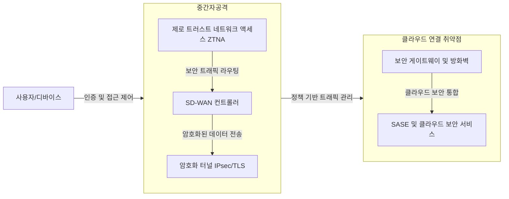

## SD-WAN 개념

- 소프트웨어 정의 네트워킹(SDN) 기술을 활용하여 기업의 WAN(Wide Area Network)을 중앙에서 효율적으로 관리하고, 클라우드 및 분산 환경에 최적화된 네트워크를 제공하는 아키텍처
- 네트워크 비용 절감: 기존 MPLS 기반 WAN보다 저렴한 인터넷 회선을 활용하여 운영 비용을 절감 / 클라우드 최적화: 클라우드 애플리케이션과의 연결 성능을 향상 / 보안 강화, 중앙 집중 관리

## SD-WAN 동작 매커니즘, 핵심요소, 보안 과제

### SD-WAN 동작 매커니즘

- 인증 및 접근 제어 문제, 중간자 공격, 클라우드 연결 취약점 존재

### SD-WAN 보안 핵심요소

| 핵심 요소 | 설명 | 적용 사례 |
| --- | --- | --- |
| End-to-End 암호화 | IPsec 및 TLS 기반의 암호화 기술을 통해 데이터 전송 시 보안 강화. | Cisco SD-WAN의 모든 트래픽 IPsec 암호화 적용 |
| 제로 트러스트 네트워크 액세스 (ZTNA) | 사용자 및 디바이스의 신원을 검증하고 최소 권한 원칙을 적용. | Palo Alto Networks의 ZTNA 기반 네트워크 접근 제어 |
| Secure Access Service Edge (SASE) | SD-WAN과 보안을 통합하여 클라우드 및 분산 환경 보호. | VMware의 SD-WAN SASE 모델 적용 |

### SD-WAN 보안 과제

| 보안 과제 | 내용 | 해결방안 |
| --- | --- | --- |
| 데이터 유출 | 분산된 네트워크에서 데이터가 노출될 위험 | End-to-End IPsec/TLS 암호화 적용 |
| DDoS 공격 | 클라우드 연결에서 발생할 수 있는 DDoS 공격 | 가상 방화벽 및 DDoS 방어 솔루션 도입 |
| 정책 불일치 | 각 지사별로 보안 정책이 일관되지 않아 취약점 발생 | SASE 모델 도입으로 통합 정책 관리|
| 인증 및 접근제어 | 분산 네트워크에서 사용자와 디바이스의 신원 확인 어려움 | AI 기반 위협 탐지와 응답 |

## SD-WAN 도입을 위한 고려사항

| 고려사항 | 설명 | 해결 방안 |
| --- | --- | --- |
| 확장성 | 네트워크 확장 시 보안 유지 및 트래픽 증가에 대응. | 클라우드 기반 보안 솔루션 및 동적 정책 적용 |
| 운영 효율성 | 복잡한 네트워크 환경에서 보안 운영을 최적화. | 통합 보안 프레임워크 및 자동화 도구 활용 |
| 규제 준수 | 금융, 의료 등 특정 산업의 보안 규제 준수 필요. | GDPR, HIPAA 등 국제 규정에 맞춘 보안 정책 도입 |
