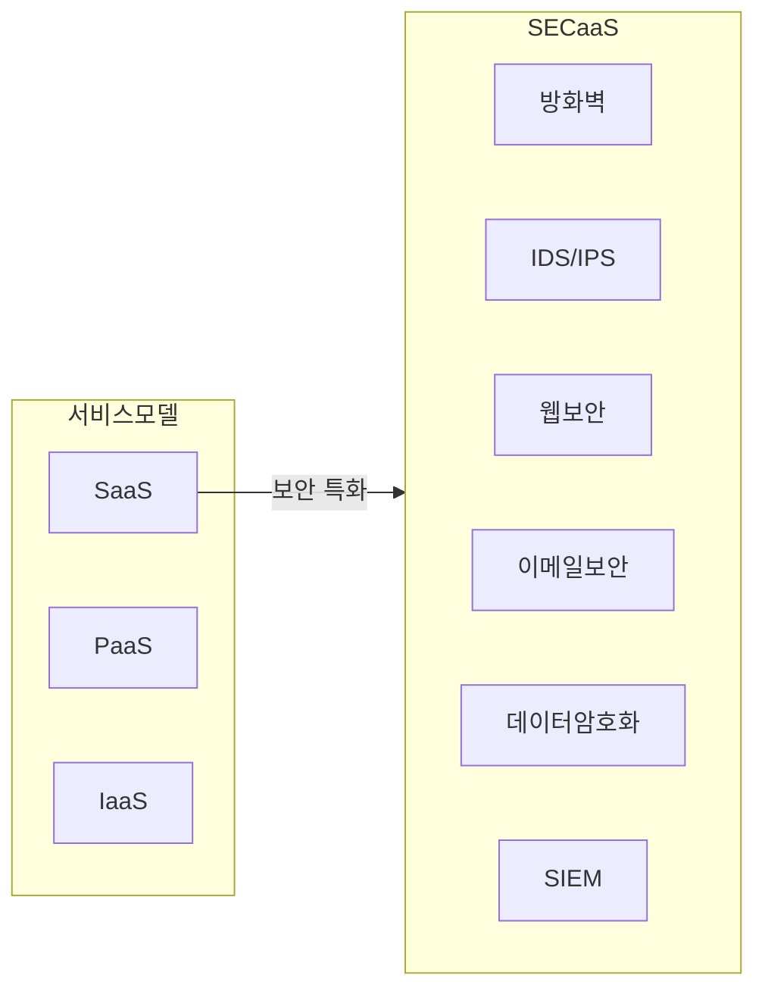

## SECaaS 개념

- 온프레미스 보안 솔루션을 자체적으로 구축하고 유지관리하는 대신, 클라우드 서비스를 통해 보안 기능을 사용하는 클라우드 서비스 모델
- 비용 절감, 최신 보안기술 도입, 보안서비스 확장 유연성, 유지보수성

## SECaaS 서비스 구성도, 서비스 유형, 적용사례

### SECaaS 서비스 구성도

### SECaaS 서비스 유형

| 구분 | 내용 | 비고 |
|---|---|---|
| 방화벽 | 클라우드 기반의 방화벽 서비스로, 트래픽 모니터링 및 제어 | 관리 용이 |
| IDS/IPS | 침입 탐지 및 방지 시스템을 클라우드에서 제공 | 실시간 탐지 |
| 웹 보안 | 웹 애플리케이션 방화벽(WAF), DDoS 보호 등 | 안정성 강화 |
| 이메일 보안 | 피싱, 스팸, 멀웨어로부터 이메일 보호 | 비즈니스 보호 |
| 데이터 암호화 | 데이터 저장 및 전송 시 암호화 서비스 | 기밀성 유지 |
| SIEM | 보안 정보 및 이벤트 관리 | 통합 관리 |

### SECaaS 적용사례

| 구분 | 내용 | 비고 |
|---|---|---|
| 대기업 | 복잡한 보안 요구 사항을 통합 관리 | 관리 효율성 증가 |
| 중소기업 | 초기 비용 부담 없이 강력한 보안 솔루션 도입 | 비용 효율성 높음 |
| 금융기관 | 민감한 데이터 보호 및 규제 준수 | 높은 보안 수준 |
| 교육기관 | 학생 및 교직원 정보 보호, 사이버 공격 방어 | 안정성 중요 |
| 의료기관 | 환자 정보 보호 및 HIPAA 준수 | 규제 준수 필수 |

## SECaaS 도입시 고려사항

- 보안 미들웨어는 SPoF가 될 수 있으므로 서비스 제공자의 신뢰성, 안정성, 과거 성과, 데이터 및 개인정보 관리 측면 검토 필요
- 클라우드 SLA를 통해 서비스 중단 시 대처 방안 약정 필요
