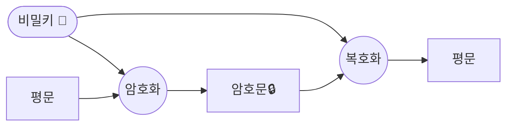
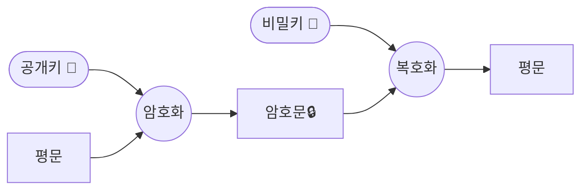

## 대칭 암호화와 비대칭 암호화의 개념

- 대칭 암호화: 암호화 때 사용하는 키와 암호문을 복호화할 때 사용하는 키가 동일한 암호화 알고리즘
- 비대칭 암호화: 암호화 때 사용하는 키와 암호문을 복호화할 때 사용하는 키가 서로 다른 암호화 알고리즘

## 대칭 암호화와 비대칭 암호화의 구성도, 구성요소

### 대칭 암호화의 구성도, 구성요소

### 비대칭 암호화의 구성도, 구성요소

- 비대칭 암호화는 대칭키를 암호화하기 위해 전자봉투로서 사용

## 대칭 암호화와 비대칭 암호화 비교

| 비교 항목 | 대칭(Symmetric) 암호화 | 비대칭(Asymmetric) 암호화 |
|---|---|---|
| 키의 관계 | 암호키 = 복호키 | 암호키 ≠ 복호키 |
| 키의 수 | 두 사람 이상이 한 개의 동일한 비밀키 공유 | 전송 당사자 간에 각각 키 생성 (Private Key, Public Key) 공유 |
| 키의 종류 | 비밀키(Secret Key) | 공개키(Public Key), 개인키(Private Key) |
| 키의 관리 | 복잡 (거래 당사자 전부 관리 필요) | 인증기관을 통해 전송 당사자 별 Private Key 발급 (상대적 단순) |
| 부인방지 여부 | 대칭키로 인하여 부인방지 불가 | 키의 이원화로 부인방지 가능 |
| 속도 | 비트 단위 암호화로 빠른 속도 제공 | 큰 소수를 처리하거나 곡률 방정식 등이 있어 속도가 느림 |
| 용도 | 개인파일 암호화, 특정 그룹 내의 파일 등의 통신에 사용 | 다수의 사용자와 주로 사용 |
| 장점 | - 키의 분배가 용이함 - 사용자 수 증가에 따라 관리할 키의 개수가 상대적으로 적음 - 키 변화의 빈도가 적음 - 여러 가지 분야에서 응용 가능 | - 암호화/복호화 속도가 빠름 - 키의 길이가 짧음 - 구현이 빠름 - 대칭키로 인하여 부인방지 가능 |
| 단점 | - 암호화/복호화 속도가 느림 - 키의 길이가 김 | - 사용자 수 증가에 따른 키 관리 포인트 증가 - 키 변화의 빈도가 많음 |
| 대표 알고리즘 | AES, SEED, DES | RSA, ECC |

## 암호화 고려사항

- 양자컴퓨터의 등장으로 RSA, ECC 같은 비대칭 암호화는 Shor 알고리즘에 취약, PQC(양자 내성 암호)로 점진적 전환 필요
