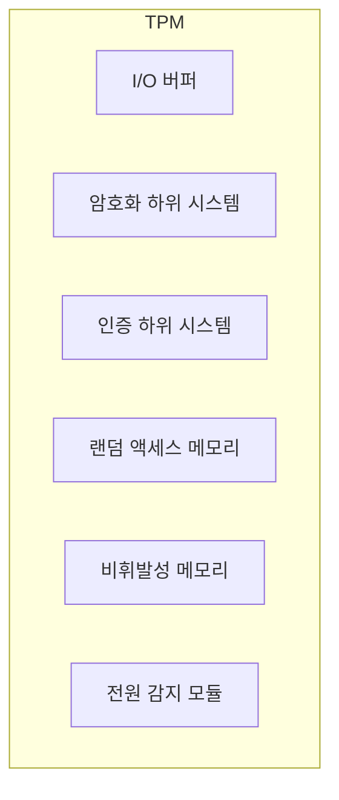

## TPM의 개념

> Trusted Platform Module

- 무결성 검증을 위해 키, 패스워드, 인증서를 안전하게 저장하기 위한 기능을 주로 하드웨어 기반으로 구현한 보안 암호화 프로세서

## TPM의 구성도, 구성요소, 적용사례

### TPM의 구성도

### TPM의 구성요소

| 구분               | 내용                                 | 비고                                |
| ------------------ | ------------------------------------ | ----------------------------------- |
| I/O 버퍼           | 입출력을 위한 버퍼                   | 호스트 시스템 간 인터페이스         |
| 암호화 하위시스템  | 암호화 기능을 담당하는 하드웨어 모듈 | RSA, HMAC, 해시, 서명 연산, 키 생성 |
| 인증 하위시스템    | 인증 기능을 담당하는 하드웨어 모듈   | 명령어 실행 전후 호출 권한 확인     |
| 랜덤 액세스 메모리 | 임시 데이터 저장을 위한 메모리       | PCR, 객체, 세션                     |
| 비휘발성 메모리    | 영구 데이터 저장을 위한 메모리       | TPM 상태, 시드, 증명 값             |
| 전원 감지 모듈     | 전원 상태 모니터링 모듈              | 전원 변동시 적절한 조치 수행        |

### TPM 적용사례

| 구분 | 내용                                              | 비고                    |
| ---- | ------------------------------------------------- | ----------------------- |
| 국내 | 삼성전자, 자사 노트북에 TPM 모듈 포함             | 윈도우11 대응           |
| 해외 | TPM 스펙 표준화 지정                              | Trusted Computing Group |
| 해외 | 마이크로소프트, 구글 등 주요 IT 기업에서 TPM 활용 | 윈도우11, 크롬OS        |

## TPM 2.0 개선 내용

- ECC 타원곡선 암호화 지원, Windows7 지원 종료
