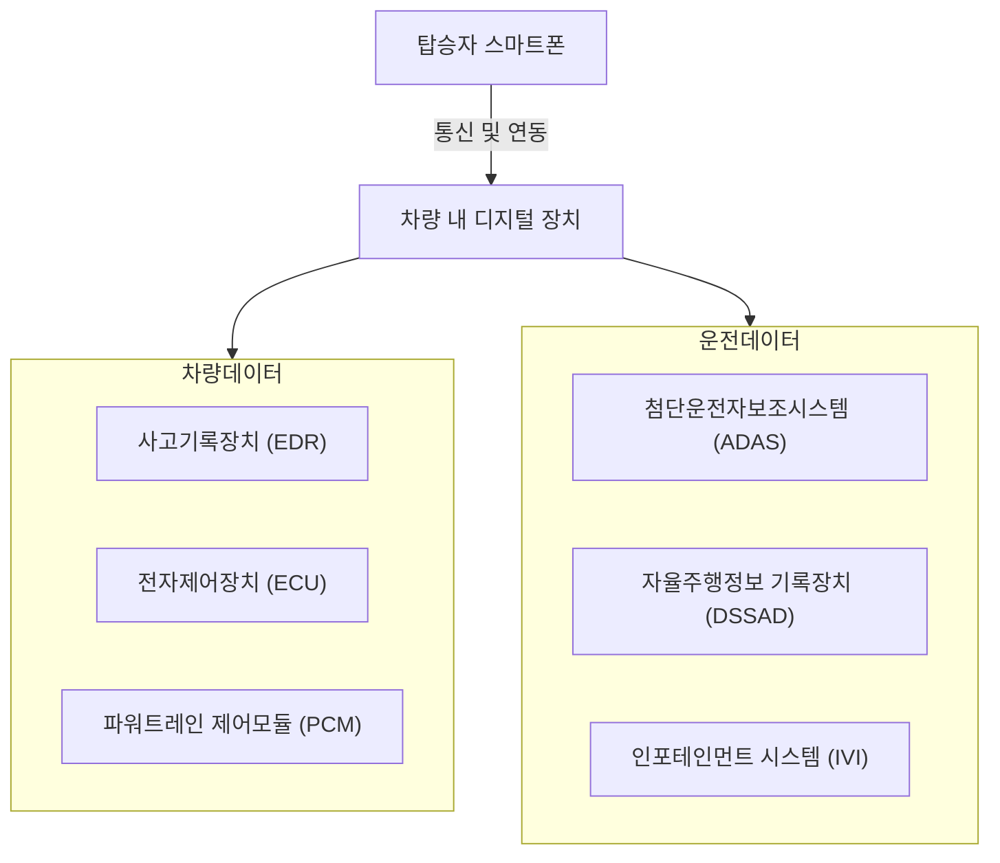

## 차량 디지털포렌식 개념

- 차량의 전장 장치 및 컴퓨팅 시스템에 저장된 디지털 데이터를 과학적 방법으로 식별, 수집, 분석, 보고하여 차량 관련 사건 및 사고를 해결하는 기술
- 자율주행 및 커넥티드카 시대의 도래로 차량에서 생성된 데이터 급증, 제조사 간 포렌식 데이터 상이, 관련 절차 미비
- 사고 원인 규명, 증거 확보, 책임소재 확인

## 차량 디지털포렌식 구성도, 구성요소, 적용사례

### 차량 디지털포렌식 구성도

### 차량 디지털포렌식 구성요소

| 구분 | 구성요소 | 내용 |
| --- | --- | --- |
| 저장 장치 | 사고기록장치(EDR) | 차량 충돌 전후 데이터 기록 및 사고 원인 분석에 사용 |
| | 전자제어장치(ECU) | 차량의 엔진, 변속기 등 주요 부품 데이터 |
| | 자율주행정보 기록장치(DSSAD) | 자율주행차의 작동 및 명령 이력 |
| | 인포테인먼트 시스템(IVI) | 내비게이션, 블루투스 연결, 멀티미디어 데이터 등 탑승자 행위 데이터 |
| 분석 도구 | OBD 포트 | 차량 진단 데이터를 수집 및 분석 |
| | 포렌식 소프트웨어 | iVe, Encase 등 차량 내 데이터 추출 및 분석 |

### 차량 디지털포렌식 적용사례

| 구분 | 사례 | 내용 |
| --- | --- | --- |
| 교통사고 | 사고 원인 분석 | IVI 데이터를 통해 운전 중 스마트폰 사용 여부 및 운전자 행위 식별 |
| 범죄 수사 | 차량 절도 및 뺑소니 수사 | 차량 내부 데이터로 도난 차량과 범인의 위치 추적 |
| 보험 분쟁 | 차량 사고 책임 소재 규명 | EDR 데이터를 통해 사고 당시 차량의 상태와 운전자의 행위 분석 |

## 차량 디지털포렌식 발전제언

| 구분 | 발전 방향 | 내용 |
| --- | --- | --- |
| 정부 | 표준화 및 법제화 | 차량 데이터 포렌식 절차를 표준화하고, 관련 법적 프레임워크를 마련 |
| | 기관 간 협력 체계 구축 | 경찰, 법원 등 수사 기관과 제조사 간 데이터 공유 협력 체계 확립 |
| | 연구개발 지원 | 차량 디지털포렌식 도구와 기술 개발에 재정적 지원 확대 |
| 기업 | 포렌식 도구 개발 | 다양한 차량 모델 및 OS를 지원하는 범용 포렌식 소프트웨어 개발 |
| | 데이터 접근성 향상 | 제조사가 제공하는 데이터 형식 통일 및 암호화 해제 지원 도구 개발 |
| | 사이버 보안 강화 | 차량 데이터의 무결성 보장을 위해 암호화 및 인증 메커니즘 적용 |
| 개인 | 개인정보 보호 | 차량 소유자의 데이터 프라이버시 보호를 위한 암호화 및 비식별화 조치 |
| | 교육 및 인식 강화 | 차량 디지털 데이터 활용과 보호에 대한 운전자 및 개인 인식 제고 |

## 참조

- [IITP: 주간기술동향 2158호](https://iitp.kr/kr/1/knowledge/periodicalViewA.it?searClassCode=B_ITA_01&masterCode=publication&identifier=1343)
