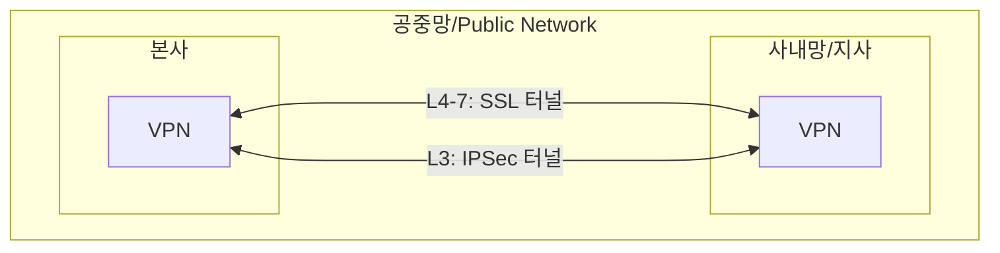
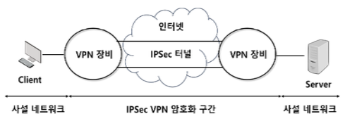
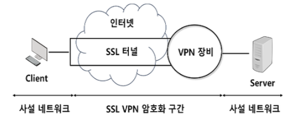

## VPN 개요

### VPN 개념

- 인터넷 같은 공중망에서 터널링 기법을 통해 사용자가 사설망에 연결된 것처럼 기밀성, 무결성을 보장하는 네트워크 통신 기술

### VPN 특징

| 구분 | 특징 | 설명 |
|---|---|---|
| 보안 측면 | 데이터 기밀성 | 암호화를 이용하여 메시지의 내용을 은폐 |
| | 데이터 무결성 | 데이터 전송 중 제3자에 의해 변환되지 않았음을 보장 |
| | 데이터 원본 인증 | 요청한 수신인에 의해 각 데이터 원본 여부 확인 |
| | 재전송 공격 방지 | 인증 헤더에 일련번호를 부여하여 재전송 공격 방지 |
| 비즈니스 측면 | 비용 절감 | 가상화를 통해 전용망과 같은 효과 기대 |
| | QoS 보장 | 네트워크 사용자 품질 보증 기술로 활용 |

## IPSec VPN, SSL VPN

### IPSec VPN

- 단말간 안전한 통신망 연결을 위해 IPSec Tunneling 기술 이용하는 OSI 3계층 VPN 보안 기술

### SSL VPN

- OSI 4~7계층에서 웹 브라우저를 통해 원격 액세스를 제공하며, 사용자 인증, 데이터 암호화 및 데이터 무결성을 보장하는 VPN 보안 기술

## IPSec VPN, SSL VPN 비교

| 구분 | IPSec VPN | SSL VPN |
|---|---|---|
| OSI 레이어 | Layer 3 | Layer 4 ~ 7 |
| 표준 | RFC 4301 (IPSec 기준) | RFC 5246 (TLS 1.2 기준) |
| 프로토콜 | IP | TCP |
| 인증방식 | 비밀키 공유 | X.509 인증서 |
| 구현방식 | Site to Site (Lan to Lan) | Client to Site |
| 장점 | 높은 안정성 | 브라우저 및 Agent 방식 구현 |
| 단점 | 고비용 (전용 장비 설치 및 양단 설치) | 저비용 (전용 장비 서버측 설치) |
| 사례 | 본사와 지사의 VPN 연결 | 브라우저를 통한 기업 내부망 접속, 재택근무 |
