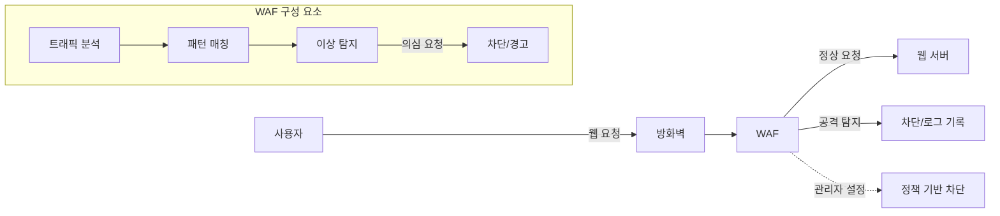

## WAF 개념

- SQL 인젝션, XSS 등 일반적인 웹 취약점으로부터 웹 어플리케이션을 보호하기 위해 트래픽을 탐지/차단하는 방화벽
- L7 계층(HTTP/HTTPS)에서 동작하며, 시그니처 기반, 행동 분석 기반 탐지 기법을 적용하여 웹 공격 방어

## WAF 구성도, 주요 기능

### WAF 구성도

### WAF 주요 기능

| 구분 | 기능 | 설명 |
| --- | --- | --- |
| 사용자 요청 검사 | 입력 검증(Input Validation) | 사용자 입력값을 필터링하여 SQL 인젝션, XSS 공격 차단 |
| | 요청/응답 필터링 | GET, POST 요청과 응답 패킷을 분석하여 이상 트래픽 탐지 |
| | 세션 관리 보호 | 인증 토큰 변조, CSRF 공격 방지 |
| 컨텐츠 보호 | 웹사이트 무결성 보호 | 웹 쉘(Web Shell) 업로드 차단, 악성 스크립트 방어 |
| | 데이터 유출 방지 | 민감 정보(주민등록번호, 카드번호 등) 포함 요청 차단 |
| | 암호화 트래픽 분석 | TLS/SSL 복호화를 통해 암호화된 공격 탐지 |
| 보안 | 시그니처 기반 탐지 | OWASP Top 10 기반 탐지 패턴 적용 |
| | 행동 분석 기반 탐지 | 이상 징후(비정상 요청 패턴, 속도, 빈도) 감지 |
| | DDoS 방어 | HTTP Flooding, Slowloris 등 L7 DDoS 공격 차단 |
