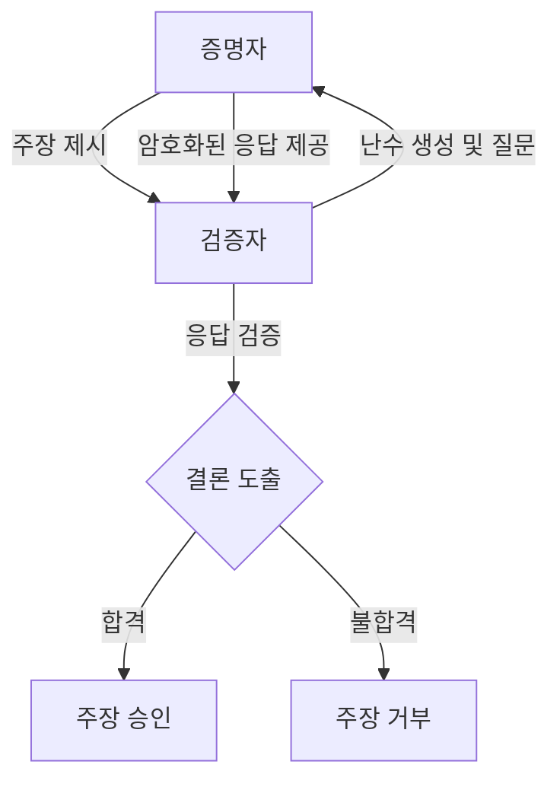

## 영지식 증명 개념

- 한 당사자(증명자, Prover)가 다른 당사자(검증자, Verifier)에게 특정한 정보를 알고 있다는 사실을 입증하면서, 해당 정보 자체는 공개하지 않는 암호학적 기법
- 개인정보 보호 강화, 거래내역 익명 처리, 스마트 계약 조건 검증, 개인정보 규제/신뢰 준수, 중간자 공격 방지

## 영지식 증명 매커니즘, 구성요소, 활용방안

### 영지식 증명 매커니즘

- 완전성, 건전성, 영지식성을 만족하여 비밀을 알고 있는 것을 증명

### 영지식 증명 구성요소

| 구성요소 | 설명 | 비고 |
| --- | --- | --- |
| 증명자(Prover) | 특정 정보를 알고 있음을 증명하려는 주체 | 사용자 또는 클라이언트 |
| 검증자(Verifier) | 증명자의 주장이 올바른지 확인하는 주체 | 서버 또는 서비스 제공자 |
| 난수(Randomizer) | 검증 과정에서 사용되는 무작위 값으로, 보안성을 높이는 역할 | 해시 함수 출력값 |
| 프로토콜(Protocol)| 증명과 검증을 위한 절차와 규칙 | zk-SNARK, zk-STARK |
| 암호화 기법 | 정보를 안전하게 전달하고 변조를 방지하기 위한 기술 | 타원곡선암호(ECC), RSA |

### 영지식 증명 활용방안

| 분야 | 활용방안 | 장점 |
| --- | --- | --- |
| 블록체인 | 트랜잭션의 유효성 검증 및 프라이버시 보호 | 투명성과 익명성 동시 확보 |
| 금융 서비스 | 고객 인증 및 자금 세탁 방지 | 개인 정보 노출 최소화 |
| 의료 데이터 관리 | 환자 정보 접근 권한 검증 | 민감한 의료 데이터 보호 |
| IoT 보안 | 디바이스 간 신뢰 구축 및 데이터 무결성 검증 | 경량화된 보안 솔루션 제공 |
| 신원 인증 | 생체정보 기반 인증 시스템 | 생체정보 노출 방지 |

## 영지식 증명 도입을 위한 고려사항

| 고려사항 | 설명 | 해결방안  |
|--|--|----|
| 성능 문제 | 복잡한 계산으로 인해 처리 속도가 느릴 수 있음 | 하드웨어 가속기 활용 |
| 프로토콜 선택 | 다양한 프로토콜 중 적합한 것을 선택해야 함 | 요구사항에 맞는 프로토콜 평가 |
| 표준화 부족 | 아직 표준화된 프로토콜이나 구현체가 부족함 | 커뮤니티 참여 및 표준화 추진 |
