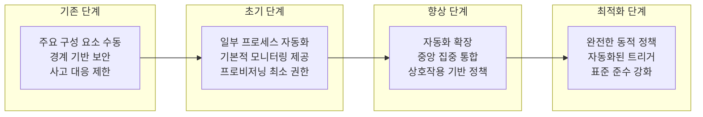

## 제로트러스트 성숙도 모델 개념

- 네트워크 경계 보안에서 벗어나 기업의 보안 체계 성숙도를 평가하고 도입 과정을 체계화하기 위한 모델
- 기존 1.0 모델의 보안 요구사항 구체성 부족, 세부 기능과 단계별 가이드 부재, 클라우드 및 분산네트워크 환경 적용방안 제한적

## 제로트러스트 성숙도 모델 개념도, 세부 내용, 도입절차

### 제로트러스트 성숙도 모델 개념도

### 제로트러스트 성숙도 모델 세부내용

| 단계 | 주요 특징 | 설명 |
| --- | --- | --- |
| 기존 단계 | 정적, 경계 기반, 수동 | 경계 기반 보안, 제한된 사고 대응 및 시스템 가시성 |
| 초기 단계 | 일부 프로세스 자동화 | 속성 기반 모니터링과 프로비저닝 최소 권한 관리 가능 |
| 향상 단계 | 자동화 범위 확장 및 중앙 집중 통합 | 중앙 집중 정책 관리, 상호작용 기반 정책 적용 |
| 최적화 단계 | 동적 정책 실행 및 완전 자동화 | 동적 정책 기반 트리거 생성 및 표준화된 정책 준수 |

### 제로트러스트 성숙도 모델 도입절차

- 식별자/신원, 기기/엔드포인트, 네트워크, 시스템, 애플리케이션, 데이터, 가시성/분석, 자동화/통합 관점의 체크리스트를 관리하여 기업의 철통인증지침 도입, 운영 계획 수립

## 제로트러스트 성숙도 달성을 위한 고려사항

- 최적화 수준은 단기적으로 달성할 수 있지 않으므로 조직의 현재 성숙도 수준에 맞춘 점진적 도입 필요
- 지속적인 위협 평가와 시스템 성능 개선 방안 수립 필요
