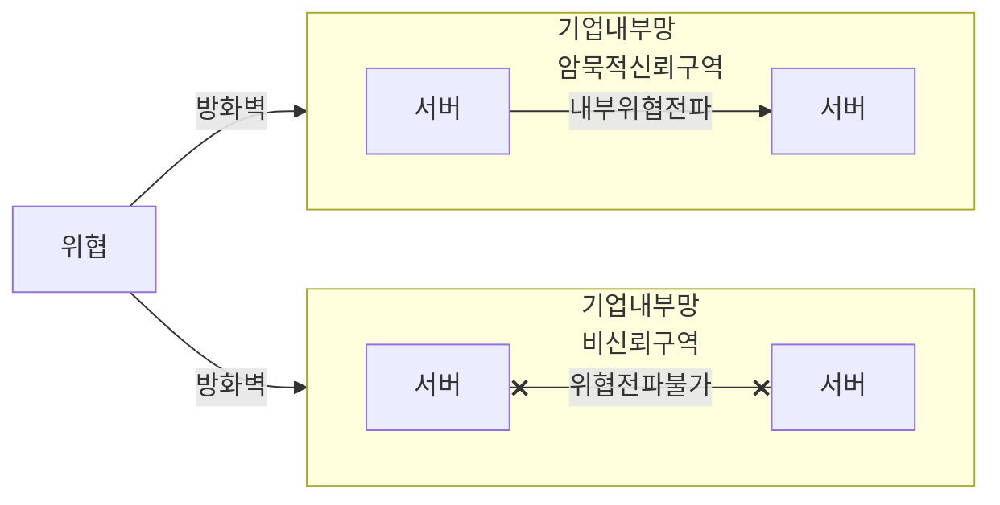
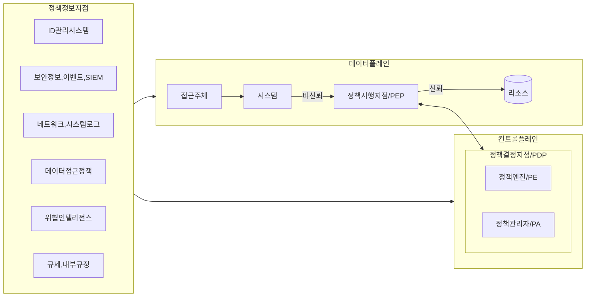

## 제로 트러스트 보안의 개념

- 전통적 보안 모델과 달리 네트워크 내/외부를 고려하지 않고, 모든 접근 요청에 대해 철저한 인증과 검증을 끊임없이 수행하는 보안 모델
- 클라우드 컴퓨팅, 원격 근무로 인한 네트워크 경계의 모호성, 지능화된 사이버공격, 데이터 유출 위험의 증가 방지

## 제로 트러스트 보안의 개념도, 핵심요소, 적용 분야

### 제로 트러스트 보안의 개념도

- 제로 트러스트 패러다임에 맞는 지속적인 요청 검증, 마이크로 세그먼테이션, SDN기반 경계 정의 (==SDP==) 필요

### 제로 트러스트 보안 핵심요소

| 구분 | 기존 트러스트 보안 | 제로 트러스트 보안 |
| --- | --- | --- |
| 신뢰성 | 신뢰 기반 | 비신뢰 기반 |
| 인증 | 연결시에만 인증 수행 | 연결 후에도 지속적인 인증 |
| 권한 | 높은 수준 권한 부여 | 최소 수준 권한 부여 |
| 경계 | 기업망 단위 보안 경계 | SW 정의 보안 경계 |
| NW분할 | 네트워크 세그먼테이션 | 마이크로 세그먼테이션 |
| 리소스 검증 | 인증시 리소스 접근 가능 | 정책결정포인트, 정책집행포인트 |

### 제로 트러스트 적용분야

| 구분 | 분야 | 내용 |
| --- | --- | --- |
| 클라우드환경 | 클라우드 서비스 접근제어 | 클라우드 서비스 접근시 사용자기기, 앱에 대한 지속적 검증, 인증 |
| 원격근무환경 | VPN 접속시 다중 인증 | VPN 접근 사용자 인증 강화, 기기 상태 확인 |
| 데이터 보호 | 중요데이터 접근 제어 | 사용자 권한 및 데이터 접근 맥락 확인, 사용자 액션 로깅 |

## 제로 트러스트 아키텍처 보안 모델 및 구성요소

### 제로 트러스트 아키텍처 보안 모델

### 제로 트러스트 아키텍처 보안 모델 구성요소

| 구분 | 설명 | 주요 기능 역할 |
| --- | --- | --- |
| 정책결정지점(PDP) | 보안 정책을 기반으로 사용자의 접근 요청을 평가하고 결정하는 중앙집중식 관리 시스템 | 사용자와 기기에 대한 인증 및 승인, 정책 관리, 권한 부여 |
| 정책시행지점(PEP) | PDP의 결정을 실행하며, 데이터 흐름과 리소스 접근을 제어하는 역할 | 데이터 통제, 리소스 보호, 불법 접근 차단 |
| 정책정보지점(PIP) | PDP가 의사 결정을 내릴 수 있도록 데이터를 수집, 분석 및 제공하는 구성 요소 | 사용자, 디바이스, 위치, 시간, 네트워크 활동 등 환경 정보 수집 및 PDP에 실시간 데이터 제공 |
| 신뢰 평가지표 | 사용자 및 기기의 현재 상태를 평가하여 동적으로 신뢰도를 조정 | 인증 후 지속적인 모니터링, 의심 상황에서 추가 인증 또는 세션 종료 |
| 최소 권한 모델 | 사용자 및 기기에 필요한 최소한의 리소스 접근 권한만 부여하는 세밀한 접근 제어 시스템 | 리소스의 세분화된 분류 및 관리, 횡적 이동 방지, 최소 권한 원칙 준수 |
| 세션 단위 보호 | 세션 단위로 접근을 허용하며, 세션 종료 후 다시 인증이 필요하게 설계 | 통신 보호 기술 적용, 각 세션의 독립적 인증 |

## 제로 트러스트 보안 적용시 고려사항

- ITAM 도입을 선행하여 정보 자산의 추적용이성 확보

## 참조

- [과기정통부: 철통인증지침, 제로트러스트 가이드라인 2.0](https://www.msit.go.kr/bbs/view.do?sCode=user&mId=307&mPid=208&bbsSeqNo=94&nttSeqNo=3185203)
- [KISA: 제로트러스트 가이드라인 1.0](https://www.kisa.or.kr/2060205/form?postSeq=20&page=1)
