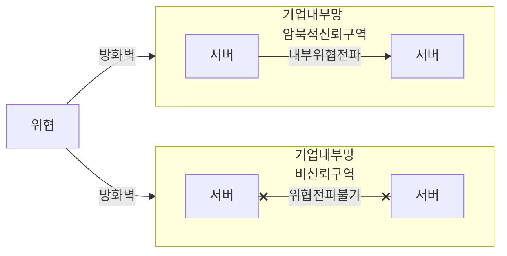

## 제로 트러스트 보안의 개념

- 전통적 보안 모델과 달리 네트워크 내/외부를 고려하지 않고, 모든 접근 요청에 대해 철저한 인증과 검증을 끊임없이 수행하는 보안 모델
- 클라우드 컴퓨팅, 원격 근무로 인한 네트워크 경계의 모호성, 지능화된 사이버공격, 데이터 유출 위험의 증가 방지

## 제로 트러스트 보안의 개념도, 핵심요소, 적용 분야

### 제로 트러스트 보안의 개념도

- 제로 트러스트 패러다임에 맞는 지속적인 요청 검증, 마이크로 세그먼테이션, SDN기반 경계 정의 필요

### 제로 트러스트 보안 핵심요소

| 구분 | 기존 트러스트 보안 | 제로 트러스트 보안 |
| --- | --- | --- |
| 신뢰성 | 신뢰 기반 | 비신뢰 기반 |
| 인증 | 연결시에만 인증 수행 | 연결 후에도 지속적인 인증 |
| 권한 | 높은 수준 권한 부여 | 최소 수준 권한 부여 |
| 경계 | 기업망 단위 보안 경계 | SW 정의 보안 경계 |
| NW분할 | 네트워크 세그먼테이션 | 마이크로 세그먼테이션 |
| 리소스 검증 | 인증시 리소스 접근 가능 | 정책결정포인트, 정책집행포인트 |

### 제로 트러스트 적용분야

| 구분 | 분야 | 내용 |
| --- | --- | --- |
| 클라우드환경 | 클라우드 서비스 접근제어 | 클라우드 서비스 접근시 사용자기기, 앱에 대한 지속적 검증, 인증 |
| 원격근무환경 | VPN 접속시 다중 인증 | VPN 접근 사용자 인증 강화, 기기 상태 확인 |
| 데이터 보호 | 중요데이터 접근 제어 | 사용자 권한 및 데이터 접근 맥락 확인, 사용자 액션 로깅 |

## 제로 트러스트 보안 적용시 고려사항

- ITAM 도입을 선행하여 정보 자산의 추적용이성 확보

## 참조

- [KISA: 제로트러스트 가이드라인 1.0](https://www.kisa.or.kr/2060205/form?postSeq=20&page=1)
