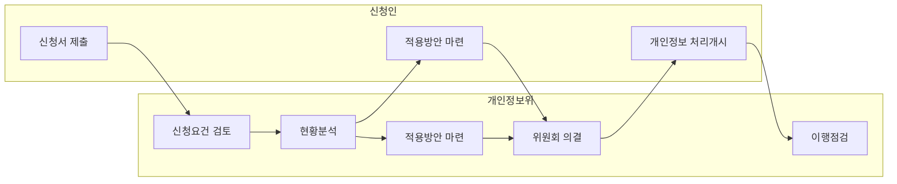

## 사전적정성 검토제 개요

- AI 등 신 서비스, 기술을 기획, 개발하는 과정에서 기존의 선례만으로는 명확한 개인정보 보호법 준수방안을 찾기 어려운 경우, 개인정보위와 협력하여 당해 개인정보 처리환경에 적합한 법 적용방안을 마련하는 제도
- 운용의 투명성 제고, 법 위반의 사후시정 불이익 예방, 정보주체의 개인정보 자기결정권 보장

## 사전적정성 검토 처리절차, 의결 사례, 활성화 방안

### 사전적정성 검토 처리절차

- 접수일로부터 60일 이내 신청인과 협의하여 법령 등 적용방안 검토 결과 작성

### 사전적정성 검토 의결 사례

| 구분 | 사례 | 비고 |
| --- | --- | --- |
| 공공 | 거짓 구인광고 신고센터 구축·운영방안 | 고용노동부 등 |
| | 안전띠 착용률 통계산출 시스템 설치·운영 방안 | |
| 기업 | 플랫폼 내 구직자의 입사지원 시 제3자 제공동의 생략방안 | 사람인 |
| | AI 영상인식 CCTV 선별관제 솔루션 설치·운영방안 | 벡터시스 |
| | 동형암호 기반 데이터 통계분석 솔루션 구축방안 | 뱅크샐러드 |
| | 안면결제 서비스 내 안면정보 등록·관리 방안 | 비바리퍼블리카 |
| | 전화 발신패턴을 이용한 보이스피싱 의심번호 예측 및 활용방안 | SK텔레콤, 중소기업은행 |
| 민간 | LLM API를 활용한 대화 데이터 기반 보고서 초안 생성방안 | 비공개 |

### 사전적정성 검토 활성화 방안

| 구분 | 방안 | 내용 |
| --- | --- | --- |
| 정부 | 신청 절차 간소화 | 개인정보보호위원회 신청 절차를 간소화하여 기업 및 민간 참여를 유도 |
| | 검토 기간 명확화 및 단축 | 검토 결과를 원칙적으로 60일 이내에 제공하여 법적 불확실성 해소 |
| | 비밀유지 조항 강화 | 신청인의 자료는 검토 목적 외 사용 금지 및 비밀유지 규정 마련 |
| 기업 | 신기술 대응을 위한 협력 강화 | AI 및 신기술 개발 기업과 협력하여 개인정보보호 적용방안 수립 |
| | 사전 검토 신청 확대 | 서비스 초기 단계에서 적극적인 사전 검토를 통해 법적 문제 사전 해결 |
| | 개인정보 보호 준수 안전장치 마련 | 시스템 설계 변경, 안전장치 추가를 통해 법령 준수 방안 보완 |

## 참조

- [국가법령정보센터: 개인정보보호위원회 사전적정성 검토제 운영규정](https://law.go.kr/admRulLsInfoP.do?admRulSeq=2100000238488)
