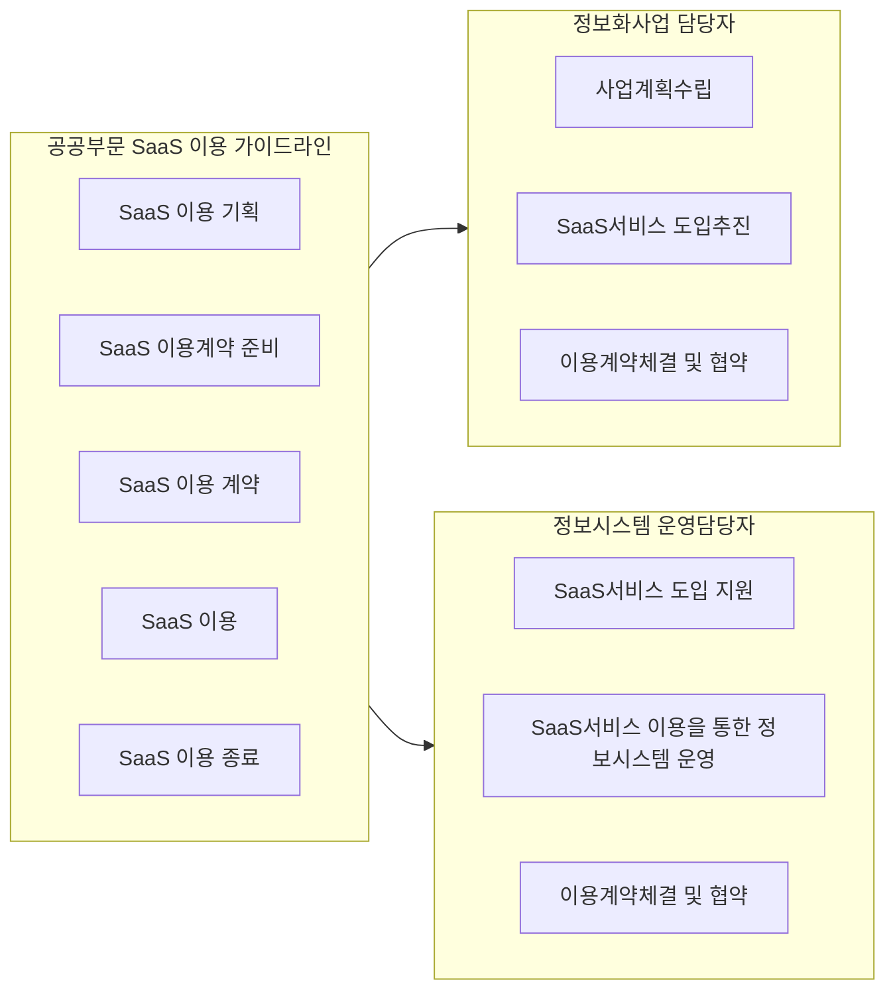
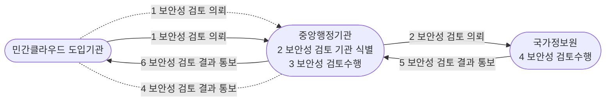
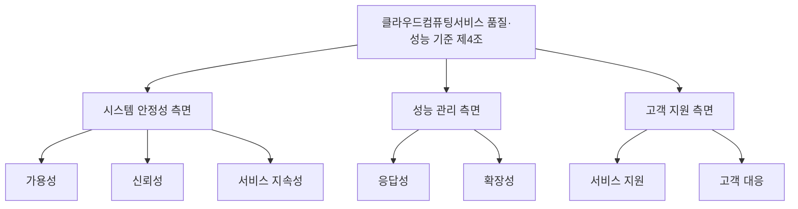

## 공공부문 SaaS 이용 가이드라인 개요

- 국가ㆍ공공기관에서 안전하고 효율적인 SaaS 이용 위한 공공부문 SaaS 이용 가이드라인 배포
- 국가 클라우드 컴퓨팅 보안 가이드라인 기준에 SaaS 환경 추가 원칙을 확장

## 클라우드 서비스 위험관리 원칙 및 기준

### 클라우드 서비스 위험관리 원칙

| 구분 | 원칙 | 상세 내용 |
|---|---|---|
| 정책 측면 | 공통 기본 원칙 | 국가클라우드 컴퓨팅 보안 가이드라인 준수 |
| | | 도입 정보보호시스템 안전성 확인  |
| | | 인터넷·업무망 분리 |
| | | 공급망 관리 |
| | SaaS 환경 추가 | 개발단계부터 보안 취약점의 원인 보안약점 배제 |
| 기술 측면 | 기본 원칙 | 인프라, 개발·운영 환경의 물리적 위치 |
| | | 보안성 확인 |
| | | SaaS 개발·운영 환경|
| | | 허가받은 외부 연동 서비스 연계 |
| | | 영역 분리  |
| | 공통 기본 원칙 | 이중화 및 백업체계 구축, 표준운영절차 수립 |
| | | 접근통제 및 격리수단 확보|
| | | 중요 업무자료 암호화 |
| | | 보안관제  |
| | SaaS 환경 추가 | 외부 공개용 SaaS 영역은 내부 업무용 SaaS 영역과 분리 |
| | | SaaS 애플리케이션 보안성 강화 방안 마련 |

### 클라우드 서비스 위험관리 기준

| 분류 | 세부 보안 기준 | 적용범위 |
|---|---|---|
| 정책 | 시스템 보호 | 공통, IaaS |
| | 인적 관리 | 공통|
| | 보안 검사 | IaaS|
| 클라우드 인프라  | 가상화 인프라 | 공통, IaaS |
| | 보안관리 | 공통, IaaS |
| 가상환경 보안 | 보안관리-SaaS App 개발| SaaS|
| | 보안관리-개발운영 환경| SaaS|
| | 악성코드 방지 | SaaS|
| | 접근통제 | 공통|
| 데이터 | 관리 | 공통, SaaS |
| | 암호화| 공통|
| 인증 및 권한 | 인증 | 공통|
| | 권한  | 공통|
| 사고 및 장애 대응 | 사고 | 공통|
| | 장애  | 공통|

- 모든 유형의 클라우드 컴퓨팅 서비스에 적용해야하는 공통 보안 기준, IaaS 및 SaaS환경에서 요구되는 추가 보안 기준 확장

## 클라우드 보안성 검토

- 국가 클라우드 컴퓨팅 보안 가이드라인 참고, 국가 정보보안 기본지침에 따라 규모와 중요도를 고려하여 보안성 검토 실행/위임

## 클라우드 서비스 수준 협약

### 클라우드 서비스 수준 협약 개념도

- 클라우드 제공자에게 서비스 수준 협약서 요구 내용에 대해 정기/수시 확인, 필요시 개선 요구

### 클라우드 서비스 수준 협약 상세 설명

| 구분 | 기준 | 상세 설명 |
|---|---|---|
| 시스템 안정성 측면 | 가용성 | 가용률 측정을 위한 기능 보유 및 유지 능력 |
| | 신뢰성 | 서비스 회복시간, 백업 주기, 백업 준수율 |
| | 서비스 지속성 | 재무 상태 및 기술 보증, 서비스 추진 전략 |
| 성능 관리 측면 | 응답성 | 응답시간 측정을 위한 기능 보유 및 유지 능력 |
| | 확장성 | 이용자 요구에 따른 자원 양 줄이거나 늘리는 기능 |
| 고객 지원 측면 | 서비스 지원 | 단말, 운영체계 등 이용자 서비스 지원 체계 |
| | 고객 대응 | 고객 대응 및 고객 불만 수집 체계 및 처리 절차 |
