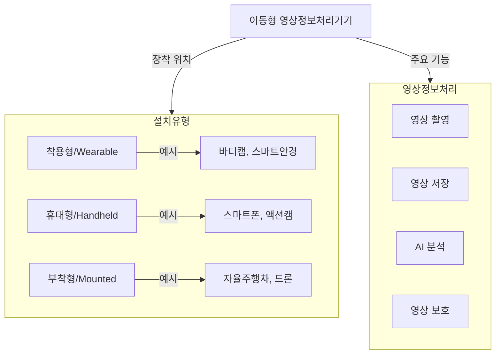

## 이동형 영상정보처리기기의 개념

- 자율주행차, 로봇, 드론, 바디캠, 스마트 가전 등의 기기에 부착된 영상처리 장치를 의미하며, 영상 수집·처리 기능을 갖춘 기기
- AI 및 IoT 기술과 융합되어 공공 안전, 교통 관제, 환경 모니터링 등 다양한 분야에서 활용됨
- 사회적 편익 증가하나, 개인정보보호 및 프라이버시 침해 가능성

## 이동형 영상정보처리기기 개념도, 구성요소, 개인정보보호 방안

## 이동형 영상정보처리기기 개념도

- 정보주체가 촬영에 대한 거부의사 없는 경우와 안전용도의 사생활침해우려장소 촬영 허용

### 이동형 영상정보처리기기 구성요소

| 구분 | 설명 | 예시 |
| --- | --- | --- |
| 영상 수집 | 카메라 모듈, 광학 센서 | 스마트폰, 바디캠, 드론 |
| 저장 장치 | 로컬 스토리지, 클라우드 연동 | SD 카드, 서버 저장 |
| 처리 기술 | AI 영상 분석, 객체 인식 | 얼굴 인식, 번호판 인식 |
| 보안 장치 | 암호화, 접근제어 | 블러링, 마스킹 처리 |
| 전송 방식 | 무선 네트워크, IoT 연동 | Wi-Fi, 5G, 블루투스 |

### 이동형 영상정보처리기기 개인정보 보호방안

| 구분 | 주요 내용 | 적용 예시 |
| --- | --- | --- |
| 관리적 | 접근 권한 관리, 내부 감시체계 구축 | 관리자 로그 기록, 보안 교육 |
| 기술적 | 데이터 암호화, AI 기반 자동 마스킹 | 영상 암호화 저장, 얼굴 블러링 |
| 물리적 | 저장 장치 분리, 장치 도난 방지 | 블랙박스 저장 공간 암호화, CCTV 보호함 |

## 참조

- [국가법령정보센터: 개인정보 보호법 25조의 2](https://www.law.go.kr/법령/개인정보보호법/(20240315,19234,20230314)/제25조의2)
