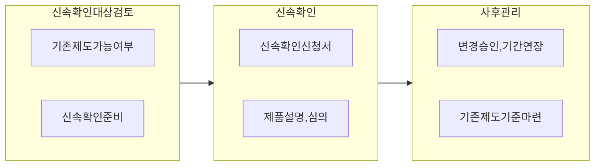

## 정보보호제품 신속확인제도

- 신기술, 융복합 제품에 대해 최소한의 절차와 인증 기준으로 보안제품을 평가한 뒤 평가 기준이 마련될 때까지 공공부문에 제품을 적용할 수 있도록하는 제도
- 기존 인증제도에 평가기준이 없는 제품의 공공시장 진입 가능, 정부 및 공공기관의 혁신 제품 도입을 통한 신규 보안 위협 대응

## 정보보호제품 신속확인제도 절차도, 세부절차, 도입요건

### 정보보호제품 신속확인제도 절차도

### 정보보호제품 신속확인제도 세부절차

| 구분 | 내용 | 비고 |
| --- | --- | --- |
| 기존제도 가능여부 검토 | 제품이 기존 인증제도에서 평가 가능한지 검토 | CC인증 등 |
| 신속 확인 준비 | 신속 확인 신청을 위한 점검 | 취약점 진단, 기능 시험 |
| 신속 확인 신청 | 진단서, 평가서, 서약서 제출 | 2개월 소요 |
| 심의 및 확인서 발급 | 심의 적합시 확인서 발급 | 2년 유효기간 |
| 변경 승인 기준 마련 | 변경시 취약점 코드 점검, 기존제도 평가 기준 마련시 연장 불가 | 변경 관리 |

### 정보보호제품 신속확인제도 도입 요건

- '가' 그룹의 경우 국정원의 보안적합성 검증 필요
- 세부 요건은 국가사이버안보센터 보안적합성 검증 체계 참조

## 정보보호제품 신속확인제도 발전방향

- 국가용 보안 요구사항에 정의된 내용을 기반으로 체크리스트 도입, 정보보호 기업의 준비절차 간소화
