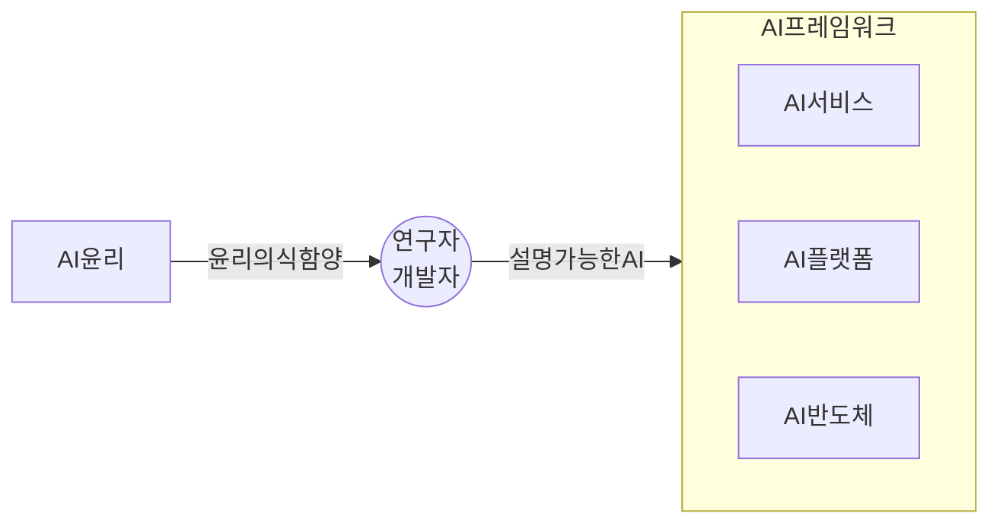
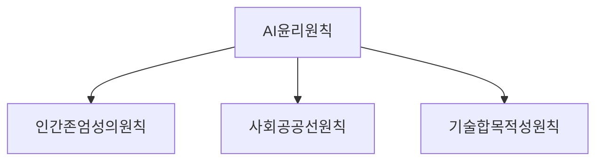
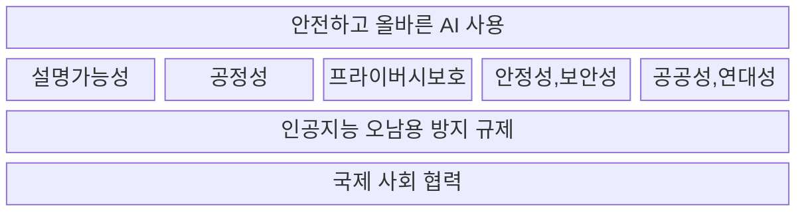

## 인공지능 윤리의 개념

- AI 산업 전반에서 AI시스템의 개발, 배포, 사용과 관련된 윤리적 원칙가 가치
- AI의 급속한 발전으로 인한 오남용이 심화됨에 따라 AI 개발, 적용 과정에서의 설명가능성, 투명성 확보를 위한 윤리 기준과 거버넌스 필요

## 인공지능 윤리의 주요 원칙, 적용방안

### 인공지능 윤리의 주요 원칙

### 인공지능 윤리 주요 원칙 상세설명

| 구분 | 세부 원칙 | 설명 |
| --- | --- | --- |
| 인간존엄성 | 인권보장 | 인간중심, 인권, 자유 보장 |
| - | 프라이버시 보호 | 사생활 보호, 개인정보 오용 최소화 |
| - | 다양성 존중 | 다양성, 접근성 보장, 편향 및 차별 금지 |
| 사회공공선 | 침해 금지 | 인간에 무해한 목적으로 활용 |
| - | 공공성 | 인류 공통 이익 중시, 순기능 극대화 |
| - | 연대성 | 이해관계자 참여 기회 보장 |
| 기술합목적성 | 데이터 관리 | 목적 외의 용도 사용 금지, 품질 관리 |
| - | 책임성 | 책임 명확화, 주체별 책임 분산 |
| - | 안전성 | 잠재적 위험 방지, 안전 보장 활동 |
| - | 투명성 | 설명 가능성 확보, 유의사항 고지 |

- AI 윤리 원칙을 준수하기 위해 기업 내 AI 거버너스 확립

## AI 거버넌스 모형 개념도, 구성요소, 주요 사례

### AI 거버넌스 모형 개념도

### AI 거버넌스 구성요소

| 구분 | 요소 | 설명 |
| --- | --- | --- |
| 기술 | 설명가능성 | 희소오토인코더 기반 xAI 구현 |
| - | 공정성 | 편향, 차별 식별 및 제거 |
| 보안 | 프라이버시 보호 | 개인 데이터 학습에 의한 침해 방지 |
| - | 안정성, 보안성 | 적대적 공격, 환각 방지 |
| 사회 | 공공성 | AI로 인한 일자리 변화 고려 |
| - | 연대성 | 긍정적인 사회 변화 선도 |
| 규제 | 오남용 방지 규제 | 딥페이크 등 오남용 규제 |
| - | 국제사회 협력 | 국제 사회 소통을 통한 규제 마련 |

### AI 거버넌스 주요 사례

| 구분 | 사례 | 내용 |
| --- | --- | --- |
| 국내 | 카카오 | 국내 최초 AI 윤리 헌장 제정 |
| - | 삼성전자 | AI 국제 컨소시엄 가입 |
| 국외 | 미국 | AI 이니셔티브 행정 명령 |
| - | EU | AI 윤리 가이드라인 발표 |
