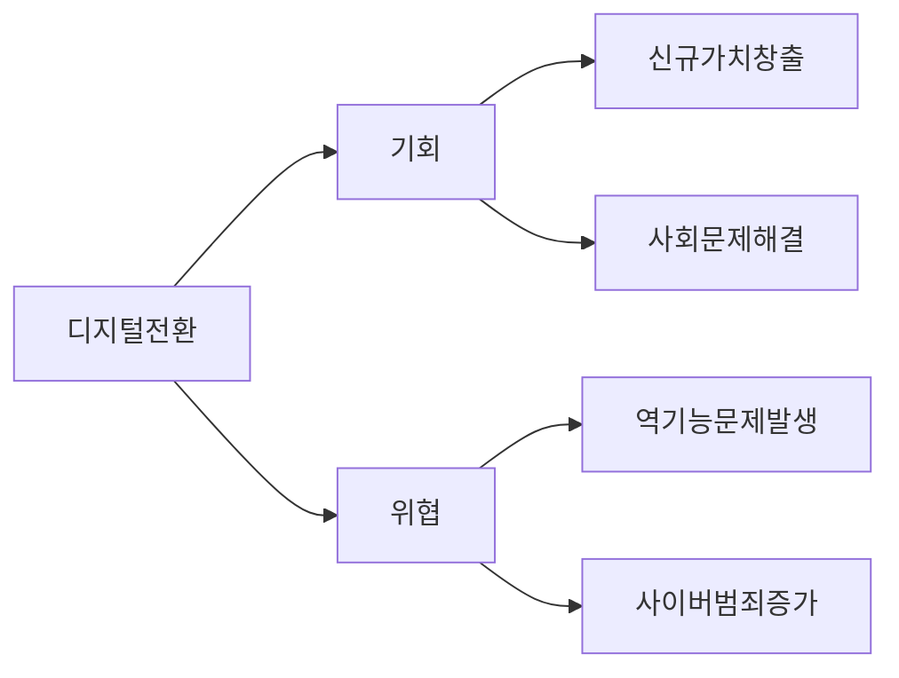

## 디지털 역기능

- 디지털 기술 및 서비스 이용과정에서 발생하는 예상치 못한 부정적인 결과
- 빠른 기술 발전 속도, 정보 격차, 디지털도구와의 의존성으로 인해 발생

## 디지털 역기능 개념도, 주요 유형, 해결방안

### 디지털 역기능 개념도

- 디지털 기술의 급격한 발전에 따라 역기능 다양화

### 디지털 역기능 주요 유형

| 구분 | 내용 | 비고 |
| --- | --- | --- |
| 디지털 허위조작 정보 | 거짓 정보를 퍼뜨려서 사람들을 의도적으로 혼란스럽게하거나 조종하려는 행위 | 가짜뉴스 전파, 조작된 정보 유통 등 |
| 디지털 혐오표현 | 특정 속성을 가진 집단이 디지털 수단을 통해 차별, 폭력 등의 표현을 받는 행위 | 악플러, 사이버 렉카 등 |
| 디지털 성범죄 | 디지털 기기로 상대방의 동의없이 신체 일부 등을 촬영, 유포, 전시하는 행위 | 텔레그램, n번방 등 |

### 디지털 역기능 해결방안

| 구분 | 내용 | 비고 |
| --- | --- | --- |
| 디지털 허위조작정보, 성범죄 | 방지, 추적 기술 | 사전 업로드 방지, 사후 추적 |
| - | 알고리즘 편향 식별 | 알고리즘 신뢰성 확보 |
| 디지털 혐오표현, 과의존 | 가상 체험 서비스 | 역기능 체험, 사전 예방 |
| - | 전문 치료 서비스 | 역기능별 사후 치료, 관리 |
| 디지털 격차 | 개인 맞춤형 가상비서 | 개인 특성, 경험 기반 |
| - | 시뮬레이션 기반 컨설팅 | 디지털 트윈 활용 격차 해소 |

## 디지털 역기능 고려사항

- 디지털 역기능 예방을 위해 디지털 리서터릿 교육 강화, 정보판별력 역량 강화
