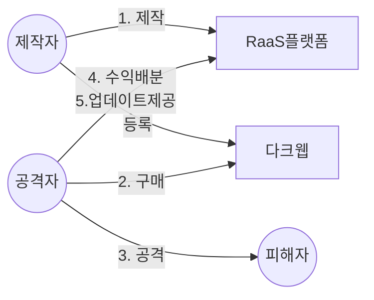

## 랜섬웨어의 개념

- 몸값(Ransome)과 소프트웨어의 합성어로 시스템을 감염시커 사용 불가능한 샅애로 만들거나, 데이터를 암호화해 사용할 수 없게한 뒤 금전을 요구하는 악성프로그램
- 다크웹 등 익명 N/W를 통해 누구나 랜섬웨어를 의뢰, 구매하여 공격에 활용할 수 있는 RaaS 형태로 진화

## RaaS의 매커니즘, 공격절차, 대응방안

### RaaS의 매커니즘

