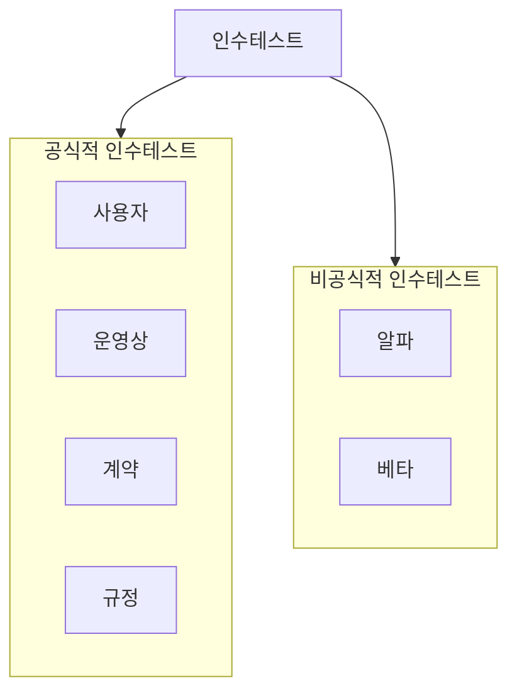
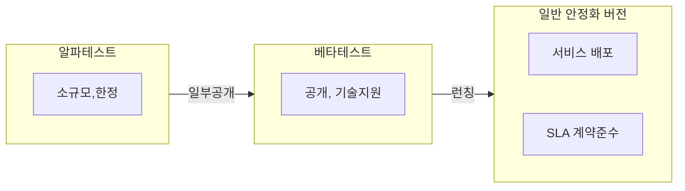

## 인수테스트의 개념

- 시스템 인수를 위해 기능, 비기능적 요구사항을 사용자가 직접 테스트하여 개발이 완료되었음을 증명하는 테스트
- 준수성 확인, 고객 피드백, 배포 가능성 평가

## 알파테스트, 베타테스트 개념도, 특징, 적용방안

### 알파테스트, 베타테스트 개념도

- 소규모, 한정된 개발환경에서 고객 피드백을 반영하고, 최종 사용자의 사용경험 확보와 이해 향상

### 알파테스트, 베타테스트 특징

| 구분 | 알파테스트 | 베타테스트 |
| --- | --- | --- |
| 환경 | 개발환경 | 사용자환경|
| 목표 | 결함발견, 부하검사, 신뢰성 | 사용자제품평가, 공개테스트서비스 |
| 시점 | 서비스 개발 완성 시점 | 공개 서비스 발매 전 최종 심의 |
| 참가자 | 개발자, 테스터, 선택된 사용자 | 고객, 최종 사용자 |

### 알파테스트, 베타테스트 적용방안

| 구분 | 알파테스트 | 베타테스트 |
| --- | --- | --- |
| 기능적합성 | 요구 기능 검증, 주요 기능 확인 | 실제 사용자 요구 충족, 기능의 실사용 평가 |
| 효율성 | 코드 최적화, 성능문제 발견 | 실제 사용 환경 내 성능테스트, 자원 사용 검토 |
| 사용성 | 사용자 인터페이스 기본 검토, 개선 | 실제 사용자 경험 수집, 만족도 평가 |
| 호환성 | 다양한 내부시스템 및 환경과 호환성 테스트 | 다양한 사용자 환경 및 플랫폼 호환성 테스트 |
| 신뢰성 | 주요 결함, 버그 식별, 시스템 안정성 초기 검토 | 장기간 사용 안정성 평가, 시스템 실패율 검증 |

## 인수테스트 고려사항

- 실제 사용자 환경에서 보안성 검토 필요
