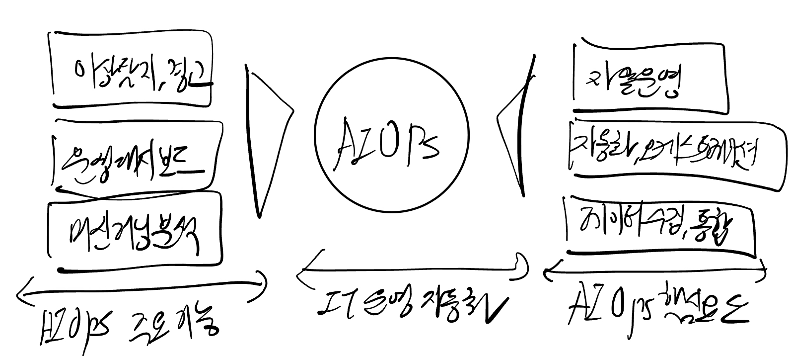

## AIOps 개념

- IT 운영 데이터를 분석하고, AI 기반으로 문제를 예측, 탐지, 해결하는 자동화 기술
- IT 운영의 효율성 제고, 서비스 중단 최소화, IT 인프라의 안정성 강화

## AIOps 구성도, 구성요소, 활용방안

### AIOps 구성도

### AIOps 구성요소

| 구분 | 내용 | 비고 |
| --- | --- | --- |
| 데이터 수집 및 통합 | IT 인프라 데이터를 중앙 집중화하여 실시간 분석 가능 | 로그, 이벤트, 메트릭 수집 |
| 머신러닝 및 AI 분석 | 머신러닝과 딥러닝을 활용하여 비정상 패턴을 식별 | 이상 탐지, 원인 분석 |
| 자동화 및 오케스트레이션 | 장애 발생 시 자동 복구 및 자원 최적화 | 자동 대응 조치 수행 |
| 가시성 및 대시보드 | Grafana, Kibana 등을 활용한 IT 운영 상태 시각화 | 실시간 모니터링 |
| 자율 운영(Self-Healing) | 시스템 오류 발생 시 AI가 원인 분석 후 자동 복구 수행 | AI 기반 자동 복구 |

### AIOps 활용방안

| 구분 | 설명 | 활용 사례 |
| --- | --- | --- |
| 이상 탐지 및 사전 경고 | AI 기반 성능 및 보안 모니터링 | AWS GuardDuty를 활용한 비정상 네트워크 패턴 탐지 |
| IT 서비스 관리(ITSM) 최적화 | AI 기반 티켓 자동 분류 | ServiceNow AIOps를 활용한 장애 대응 프로세스 최적화 |
| 애플리케이션 성능 관리(APM) | AI 기반 성능 최적화 | Dynatrace를 활용한 실시간 애플리케이션 트랜잭션 분석 |
| 하이브리드 클라우드 관리 | 클라우드 및 온프레미스 자원 관리 | IBM Watson AIOps를 통한 IT 인프라 운영 최적화 |
| 보안 운영 자동화 | AI 기반 보안 이벤트 분석 | Splunk AIOps를 활용한 실시간 보안 로그 모니터링 |
