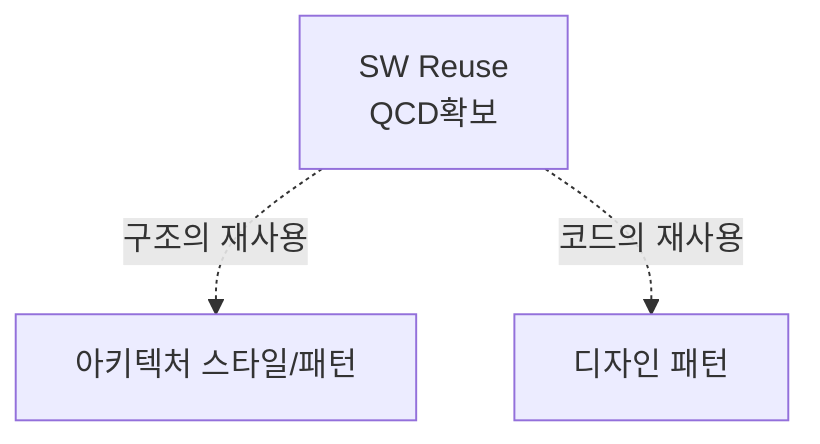

> 131/2/6

## I. 개요

### 개념

### 시사점

## II. 차이점, 핵심요소, 적용방안

### 가. 아키텍처 스타일과 디자인 패턴의 차이점

| 구분 | 아키텍처 스타일 | 디자인 패턴 |
| ---- | --------------- | ----------- |
| 역할 | -               | -           |

### 나. 아키텍처 스타일 유형

| 구분 | 내용 | 비고 |
| ---- | ---- | ---- |
| -    | -    | -    |

### 다. 디자인패턴 유형

| 구분 | 내용 | 비고 |
| ---- | ---- | ---- |
| -    | -    | -    |

## III. 아키텍처 스타일과 디자인 패턴의 적용 전략, 접근 전략

가. ~의 적용 전략
SWOT 분석

나. ~의 적용 방안

| 구분 | 내용                | 비고 |
| ---- | ------------------- | ---- |
| 공공 | (대국민서비스 향상) | -    |
| 금융 | (가용성)            | -    |
| 민간 | (이윤추구)          | -    |

어려울 경우

| 구분          | 내용 | 비고 |
| ------------- | ---- | ---- |
| 비지니스 관점 | -    | -    |
| 기술 관점     | -    | -    |
| 보안 관점     | -    | -    |

"끝"
