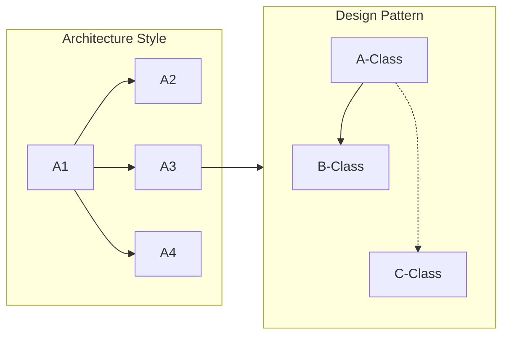

## 아키텍처스타일과 디자인패턴의 개념

- 아키텍처스타일: SW를 구성하는 서브시스템, 컴포넌트 간 관계를 분리하는 ==시스템 구조 및 스타일==
- 디자인패턴: ==SW개발 과정==에서 발견된 ==설계의 노하우==를 재사용하기 좋은 형태로 정리한 패턴

## 아키텍처스타일, 디자인패턴의 관계도, 주요 유형

### 아키텍처스타일, 디자인패턴의 관계도

### 아키텍처스타일의 주요 유형

| 구분 | 내용 | 비고 |
|---|---|---|
| Layered Architecture | 소프트웨어를 계층으로 나누어 각 계층이 특정 기능을 담당하며 상위 계층이 하위 계층에 의존하는 구조 | MVC 패턴 |
| Client-Server | 요청-응답 구조, 주로 네트워크 기반 애플리케이션에서 사용 | 웹 애플리케이션 |
| Microservices | 독립적으로 배포 가능한 작은 서비스들로 구성된 아키텍처로, 각 서비스는 특정 비즈니스 기능을 담당 | 대규모 시스템에 |
| Event-Driven | 시스템 구성 요소가 이벤트를 발생시키고, 이벤트를 수신하여 처리하는 구조 | 실시간 처리 |
| SOA | 서비스 단위로 시스템을 구성, 각 서비스는 명확하게 정의된 인터페이스로 통신 | 재사용, 유연성 향상 |
| Serverless | 요청시 CSP가 자동으로 서버 자원을 할당하고 실행하는 구조 | AWS Lambda 등 |
| Reactive | 비동기 데이터 스트림을 사용하여 변화에 빠르게 반응하는 시스템을 구성 | 고성능 실시간 시스템 |
| Pipeline | 데이터가 여러 단계를 거쳐 처리되는 구조로, 각 단계는 독립적으로 작동하고 데이터를 변환 | ETL 프로세스 등 |
| Broker | 클라이언트와 서버가 직접 통신하지 않고 중개자를 통해 통신하는 구조 | 메시지 큐 |
| Peer-to-Peer | 모든 노드가 동등한 자격으로 통신하고 자원을 공유하는 구조 | 분산 시스템 |

### 디자인패턴 주요 유형

| 구분     | 개념                                              | 비고                                  |
| -------- | ------------------------------------------------- | ------------------------------------- |
| 생성패턴 | 객체의 생성방식 결정, 클래스 정의, 구조화, 캡슐화 | Factory, Builder, Singleton           |
| 구조패턴 | 객체 조직화 방법 제시, 객체 구성에 확장성 추가    | Adaptor, Bridge, Decorator            |
| 행위패턴 | 객체 행위를 조직화, 그룹화, 객체와 클래스 연동    | Strategy, Observer, Visiter, Template |

## 아키텍처스타일, 디자인패턴 적용시 고려사항

- CBAM, ATAM을 통해 적절한 아키텍처 스타일 선택
- 디자인패턴이 적용되어있는 프레임워크 사용
