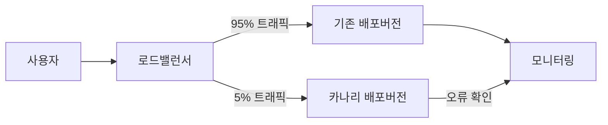

## 카나리 테스트 개념

- 새로운 버전의 소프트웨어나 시스템을 실제 사용자 환경에 배포하기 전에 ==제한된 사용자 그룹==에게 ==먼저 공개==하여 ==안정성과 성능을 검증==하는 방법

## 카나리 테스트 구성도, 구성요소, 적용방안

### 카나리 테스트 구성도

### 카나리 테스트 구성요소

| 구분 | 내용 | 비고 |
| --- | --- | --- |
| 로드 밸런서 | 사용자 트래픽을 Canary 배포와 기존 배포에 분산 | 트래픽 비율 조절 |
| 기존 배포 | 현재 운영 중인 안정적인 버전 | 대부분의 사용자에게 서비스 제공 |
| Canary 배포 | 새로운 버전의 SW 또는 시스템 | 제한된 사용자에게만 공개 |
| 모니터링 시스템 | 각 배포 환경의 성능, 안정성, 오류 등을 실시간 추적 및 비교 | 문제 발생 시 즉각적인 대응 |

### 카나리 테스트 적용방안

| 환경 | 적용 기술 | 설명 |
|---|---|---|
| 온프레미스 | L4 스위치 | L4 로드 밸런서를 활용하여 트래픽을 신규 시스템으로 점진적으로 전환 |
| | DNS | DNS 라우팅을 이용하여 특정 사용자 그룹을 신규 시스템으로 유도 |
| 클라우드 | K8S Canary 배포 | 쿠버네티스에서 Canary 방식으로 일부 트래픽을 새로운 버전으로 전송 |
| | K8S Blue-Green 배포 | 두 개의 환경(Blue, Green) 중 하나를 활성화하여 빠른 롤백 및 배포 가능 |

## 카나리 테스트 고려사항

- 문제가 발생했을 때 신속하게 이전 버전으로 ==롤백 가능한 계획== 수립 필요
