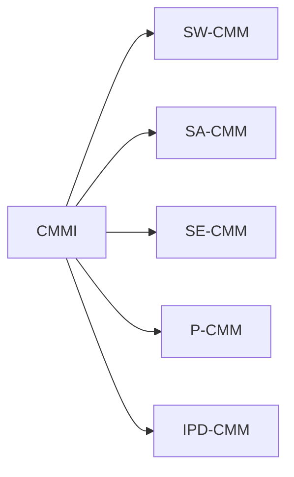

## CMMI의 개념

- SW개발조직의 ==시스템 개발 능력==과 ==조직 성숙도==를 평가하기 위한 ==지속적 품질 개선모델==
- CMM 모델들의 상호 중첩과 상이한 구조로 인해 모델 적용시 중복 투자 및 비용 지출되어 모델 통합

## CMMI의 구성도, 구성요소, 성숙단계

### CMMI 구성도

| 구분 | 내용 |
| --- | --- |
| SW-CMM | SW프로세스 성숙도 측정, 개선 |
| SA-CMM | SW획득 과정 능력 개선 |
| SE-CMM | 시스템 공학적 적용요소 |
| P-CMM | 인적자원 능력수준 향상 |
| IPD-CMM | 통합제품 개발프로세스 개선 |

### CMMI 구성요소

| 구분 | 내용 | 비고 |
| --- | --- | --- |
| 프로세스 영역 | 특정 비지니스 목적을 달성하기 위해 필요한 관련 활동들의 집합 | 22개 영역 |
| 성숙도 레벨 | 조직의 프로세스 성숙도를 나타내는 5단계 | 초기-최적화 |
| 프로세스 수행 | 프로세스 영역 내에서 수행할 활동 및 방법 | 구체적인 실행 방법 |
| 목표 | 각 프로세스 영역이 달성해야하는 목표 | 개선 방향 제시 |

### CMMI 성숙단계

> 도정통량최

| 구분 | 단계 | 내용 |
| --- | --- | --- |
| 5 | 최적화 | 지속적인 프로세스 개선 |
| 4 | 정량적 관리 | 프로세스 정량적 성과측정, 관리 |
| 3 | 정의 | 프로세스 표준 정의, 전사 사용 |
| 2 | 관리 | 프로세스 관리 프로세스 수립, 문서화 |
| 1 | 도입 | 프로세스 미정의, 예측 불가 |

## CMMI, SPICE 비교

| 구분 | CMMI | SPICE  |
| --- | --- | --- |
| 개발주체 | 카네기 멜론 대학교 | ISO 표준 |
| 적용범위 | SW, 시스템, 서비스 등 | SW 및 시스템 |
| 평가방식 | 조직의 성숙도 수준 평가 | 프로세스 수행 능력 평가 |
| 평가단계 | 5단계 | 6단계 |
| 초점 | 프로세스 개선 및 성숙도 향상 | 프로세스 평가 및 개선 |
| 인증 | 공식 심사 통한 인증 | 없음 |

## CMMI 도입시 고려사항

- 도입 목적과 기대효과를 명확히 정의하고 조직 내 가이드하여 조직문화 조성 선행 필요
