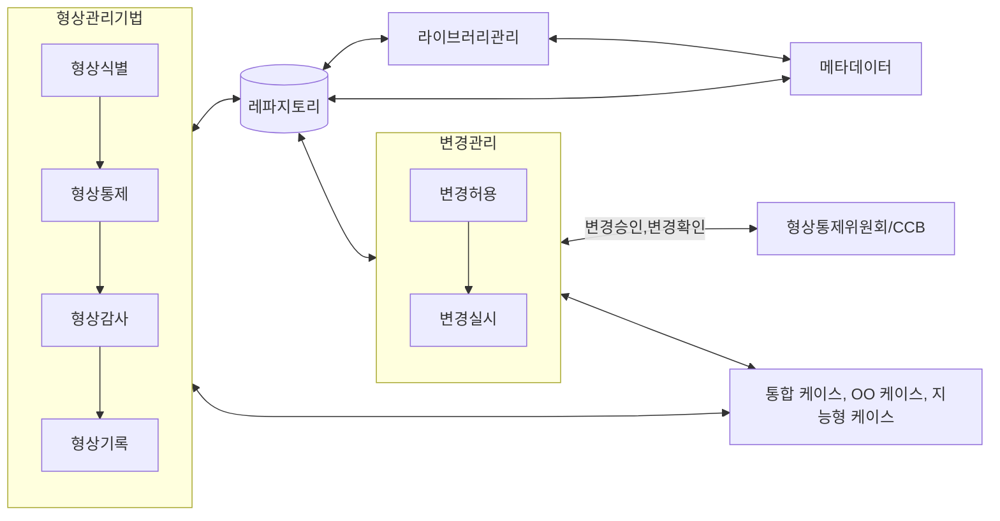
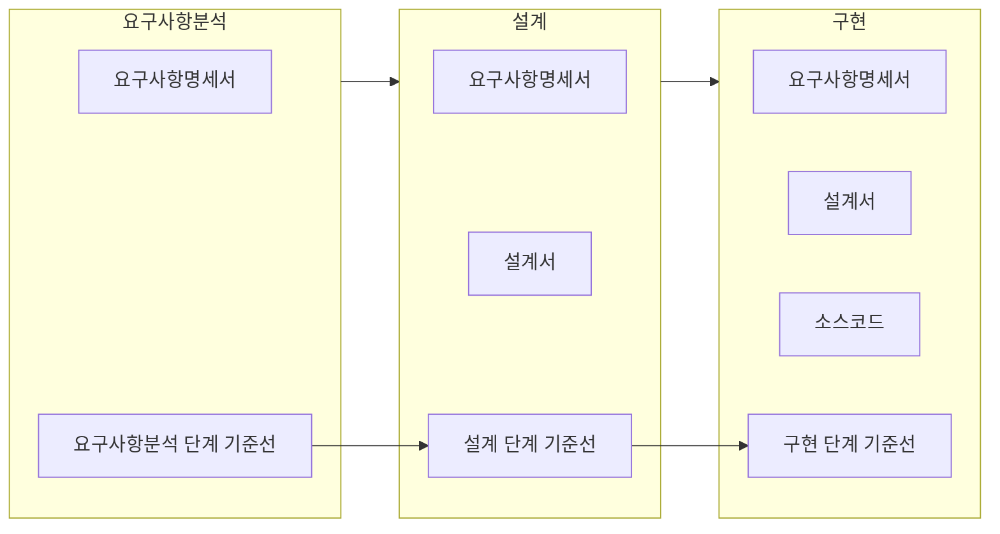

## 형상관리의 개념

- 형상 항목을 식별하고 문서화, 변경 제어, 변경 처리 상태를 기록하고 명시된 요구사항에 부합하는지 검증하는 기술적이고 관리적인 감독, 감시 활동
- 소프트웨어 생명주기 단계별로 기능적, 분배적, 설계 등 베이스라인이 구분되어 관리

## 형상관리 기준선 개념, 구성요소

### 형상관리 기준선 개념

- 대상 시스템/제품에 대한 기술적인 통제를 하게 되는 시점 또는 그 시점의 기준문서로 형상관리 프로세스의 기준으로 활용

### 형상관리 기준선 구성요소

| 기준선 | 시점 | 형상관리 항목 |
| --- | --- | --- |
| 기능적 기준선 | 사용자 요구 기능이 정의되는 시점 분배적 기준선 | 개발 계획서 |
| 분배적 기준선 | 요구 기능이 서브시스템으로 분할되는 시점 | 요구사항 정의서 |
| 설계 기준선 | 설계 사양이 완성되는 시점 시험 기준선 | ERD, UML |
| 테스트 기준선 | 테스트를 위한 준비 시점 | 실행 코드 |
| 제품 기준선 | 통합, 기능, 성능 등 시험 완료 시점 운용 기준선 | 테스트 결과서 |
| 운용 기준선 | 개발 완료 후 운영 이관 시점 형상 관리 항목 | 사용자/운영자 매뉴얼 |
