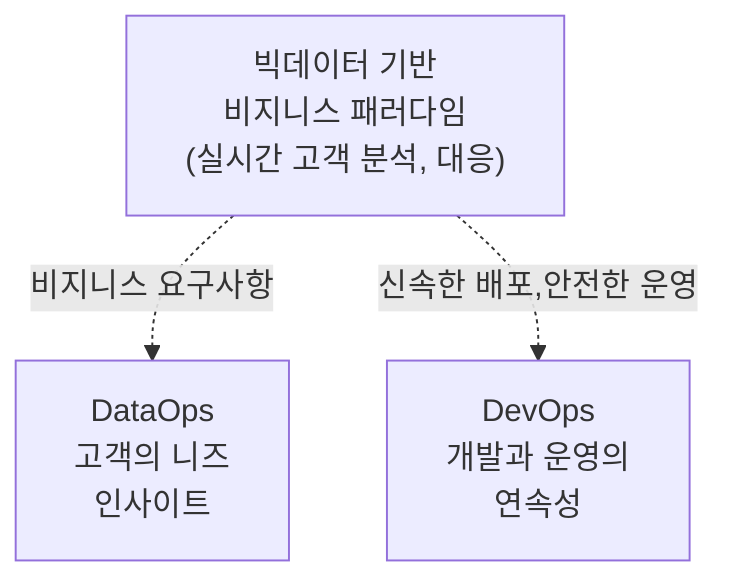
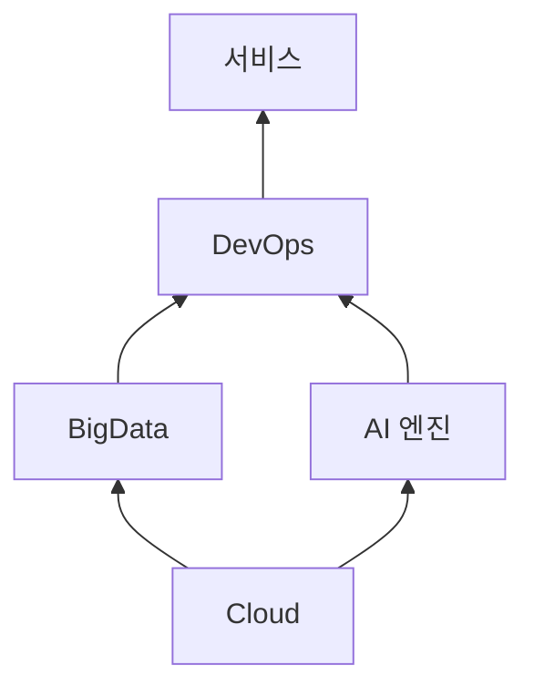

> 130/4/6

## I. 개요

### 가. 데이터옵스, 데브옵스 개념

### 나. 배경

디지털트랜스포메이션으로 인한 빅데이터, DevOps의 중요성 증가.

## II. 데이터옵스 아키텍처

가. ~의 구조 (구성도, 개념도)
나. ~의 핵심요소
가.에 그린 다이어그램을 3단 표로 작성

| 구분 | 내용 | 비고 |
| ---- | ---- | ---- |
| -    | -    | -    |

## III. 데이터옵스 주요 기술

가. ~의 적용 전략
SWOT 분석

나. ~의 적용 방안

| 구분 | 내용                | 비고 |
| ---- | ------------------- | ---- |
| 공공 | (대국민서비스 향상) | -    |
| 금융 | (가용성)            | -    |
| 민간 | (이윤추구)          | -    |

어려울 경우

| 구분          | 내용 | 비고 |
| ------------- | ---- | ---- |
| 비지니스 관점 | -    | -    |
| 기술 관점     | -    | -    |
| 보안 관점     | -    | -    |

## IV. 데이터옵스의 추가적인 고려사항

- AI를 활용하는 MLOps로까지 확장하여, 데이터 기반의 의사결정을 더 빠르게 가져갈 수 있음.

"끝"
