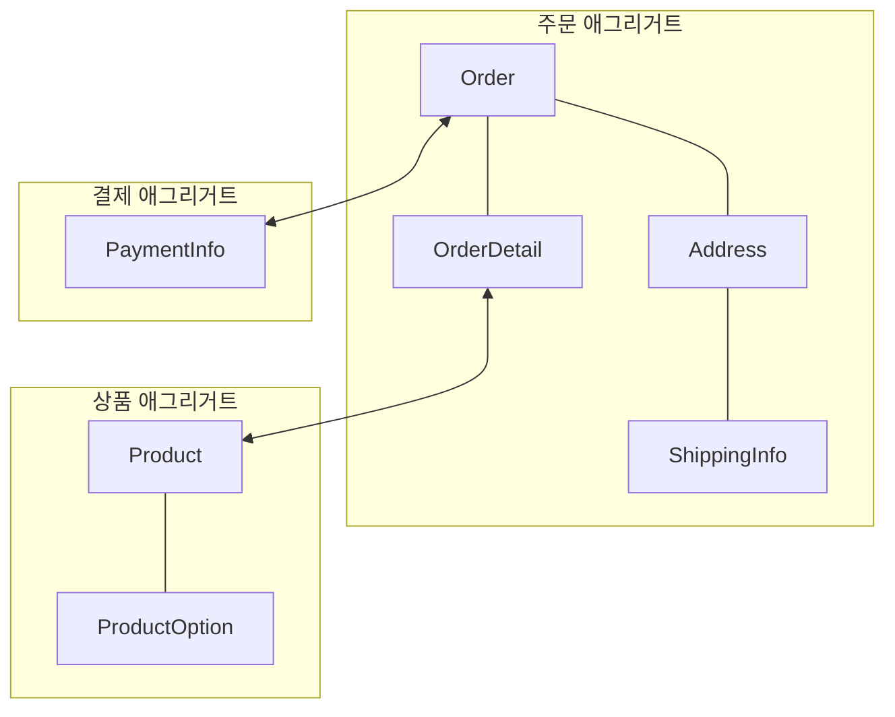

## 에그리거트 개념

- 도메인 주도 설계(DDD)에서 도메인 모델의 논리적 단위를 정의하며, 데이터 무결성을 유지하고 복잡성을 관리하는 역할 담당
- 데이터 무결성 보장, 복잡성 관리, 비지니스 로직을 캡슐화하여 도메인 논리 표현

## 애그리거트 개념도, 역할, 기대효과

- 다양한 Entity와 Value Object를 하나로 묶어 도메인 간 관계를 상위 수준에서 관리

### 애그리거트 역할

| 역할 | 설명 | 예시 |
| --- | --- | --- |
| 경계 정의 | 도메인 모델의 경계를 설정하고 외부 접근 제한 | 주문 애그리거트 내부의 결제 정보 접근 제한 |
| 데이터 무결성 | 트랜잭션 단위로 작동하여 일관된 상태 유지 | 주문 상태와 결제 정보 동시 처리 |
| 루트 엔티티 관리 | 외부에서 애그리거트 내부 객체 접근 시 루트 엔티티를 통함 | 주문 애그리거트의 루트 엔티티를 통해 모든 작업 수행 |

### 애그리거트 사용시 기대효과

| 문제 | 세부 내용 | 해결 방안 |
| --- | --- | --- |
| 복잡성 관리 | 대규모 도메인 모델에서 객체 간 상호작용 복잡성 증가 | 명확한 경계 설정으로 객체 간 의존성 최소화 |
| 데이터 일관성 | 트랜잭션 처리 중 데이터 불일치 발생 가능성 | 애그리거트 내부에서만 상태 변경하여 일관성 보장 |
| 모듈화 | 도메인 모델 간 강한 결합으로 인한 재사용성 저하 | 애그리거트 간 느슨한 결합으로 모듈화 구현 |
| 도메인 논리 표현 | 비즈니스 규칙이 분산되어 복잡성 증가 | 애그리거트 내부에서 도메인 로직 캡슐화 |

## 애그리거트 설계시 고려사항

| 고려사항 | 세부 내용 | 해결 방안 |
| --- | --- | --- |
| 트랜잭션 크기 | 큰 애그리거트로 인해 트랜잭션 성능 저하 | 작은 애그리거트로 설계하여 성능과 일관성 균형 유지 |
| 참조 관리 | 애그리거트 간 직접 참조로 인한 강한 결합 | 식별자(ID)를 활용하여 느슨한 결합 유지 |
| 도메인 규칙 반영 | 외부에서 도메인 규칙 위반 가능 | 비즈니스 로직을 애그리거트 내부에서만 실행 |
