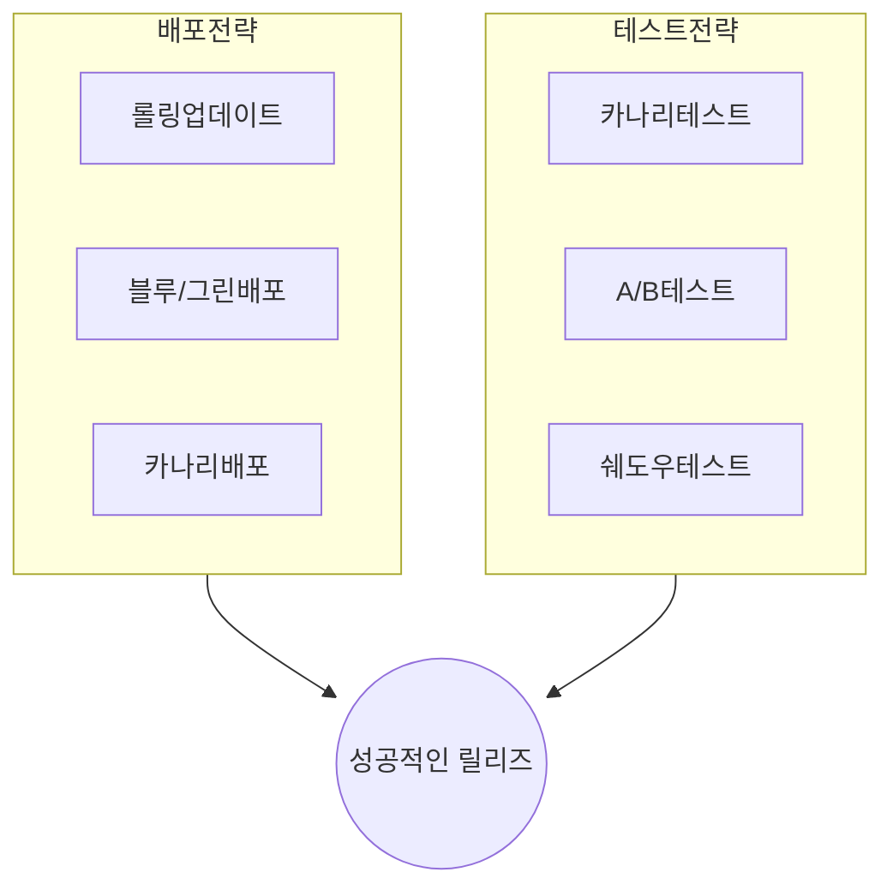

## 성공적인 릴리즈를 위한 체크포인트

## 배포전략 및 테스트전략 유형

### 배포전략

| 구분 | 개념도 | 설명 |
| --- | --- | --- |
| 롤링업데이트 | | 서버/파드 1개씩 교체하여 배포 관리 및 롤백 용이 서버 처리용량 고려 필요 |
| 블루그린배포 | | 구버전 블루, 신버전 그린, 신버전을 모두 배포 후 모든 트래픽을 스위칭 운영 환경에 영향 없음, 실서비스 환경으로 신버전 테스트 시스템 자원 두 배 필요 |
| 카나리배포 | | 트래픽 제어를 통해 일부 사용자만 신규 서버로 접속, 모니터링 디버깅수행 후 전체 스위칭 리스크 감지 용이, A/B테스트 활용 네트워크 트래픽 제어 부담 |

### 테스트전략

| 구분 | 개념도 | 설명 |
| --- | --- | --- |
| 카나리테스트 | | 변경사항을 부분적으로 출시 후 기존과 비교하여 평가 실시간 프로덕션 트래픽 테스트, 리전별 테스트 느린 릴리즈, 모니터링 복잡성, 이전버전 호환성 고려 |
| A/B테스트 | | 일부 사용자를 새 기능으로 라우팅 애플리케이션 기능 효과 측정 용이 복잡한 설정, 편향된 샘플링 |
| 쉐도우테스트 | | 트래픽을 미러링하여 신버전으로 전달하여 함께 실행 제로 프로덕션 영향, 배포 위험 감소 비용 및 운영 오버헤드 |

## 배포 및 테스트 위험을 줄이기 위한 고려사항

- 이전 버전과의 호환성
- 배포 전, 중, 후 모든 단계에서의 지속적 테스트(CT)
- IaC를 통한 자동화된 인프라 관리
