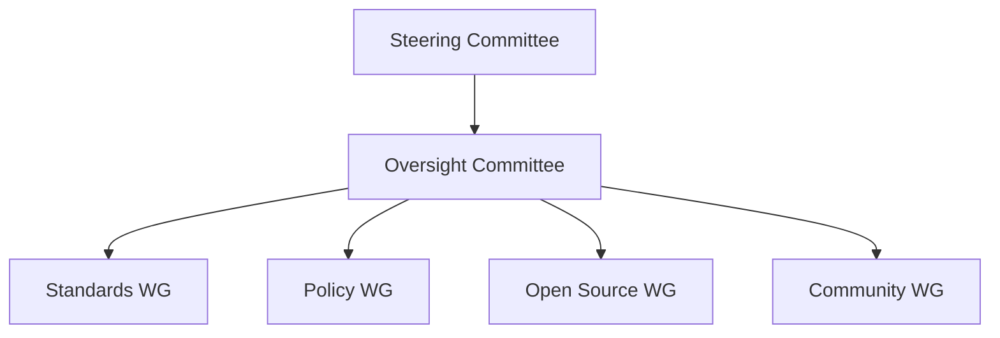

## 그린 소프트웨어 개념

- 소프트웨어 개발과 운영 과정에서 탄소 배출을 줄이고 지속 가능성을 강화하기 위해 설계된 리눅스 재단 산하 독립 오픈소스 재단
- 친환경 SW 기술 확산, 지식 전파, 관련 도구 개발, SW 탄소배출 등급, SW 탄소배출 등급 인증 등 제도 기술 마련

## 그린 소프트웨어 재단 구조도, 구성요소, 동향

### 그린 소프트웨어 재단 구조도

- SW탄소 효율 등급 표준(SCER), SW지속 가능성 분석 프레임워크(TOSS), 클라우드 사업자를 위한 실시간 에너지/탄소 정보 제공 표준(Real-Time Cloud), SW탄소배출량 측정 지표인 SCI 안내서 제정 및 활성화 기여

### 그린 소프트웨어 재단 구성요소

| 구분 | 내용 | 비고 |
| --- | --- | --- |
| 표준 작업반 | 친환경 소프트웨어 기술의 상호운영성 향상을 위한 4개의 표준 개발 프로젝트를 추진 | SCER, TOSS, Real-Time Cloud, SCI 안내서 |
| 정책 작업반 | 친환경 소프트웨어 정책 조사 및 정책 레이다 프로젝트 운영 | 녹색 인증 및 정책 대응 담당 |
| 오픈소스 작업반 | Carbon Aware SDK 등 오픈소스 도구 개발 | 친환경 SW 도구 및 탄소배출량 측정 지원 |
| 커뮤니티 작업반 | 인식 제고, 교육 활동, 모범 사례 확산 | SW 생태계 확산 및 기술 역량 강화 |

### 그린 소프트웨어 재단 동향

| 구분 | 내용 | 비고 |
| --- | --- | --- |
| 회원사 증가 | 지속 가능성을 목표로 기업 참여 확대 | MS, Google, 지멘스 등 64개 회원사 참여 |
| 표준화 작업 | SCER, TOSS 등 친환경 SW 표준 개발 | SW 탄소배출량 측정 기준 ISO 표준 승인 |
| 오픈소스 프로젝트 | SW 개발 및 운영 효율성 및 탄소 절감 도구 제공 |Carbon Aware SDK, Impact Framework, Carbon CI |

## 참조

- [IITP 주간기술동향 2148호](https://iitp.kr/kr/1/knowledge/periodicalViewA.it?searClassCode=B_ITA_01&masterCode=publication&identifier=1333)
