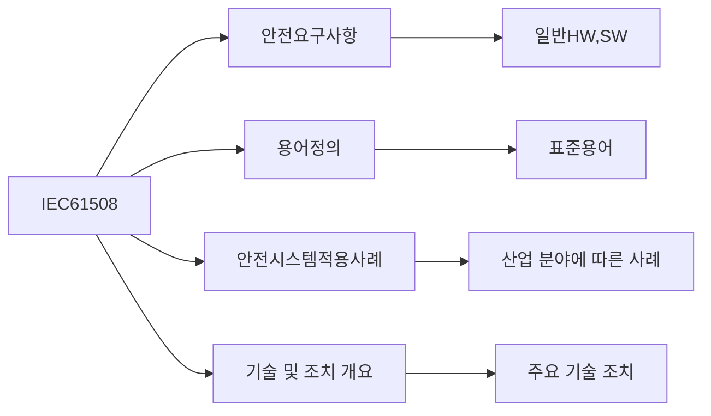

## IEC 61508의 개념

- 산업분야에서 전자, 전기, 프로갦 가능 전자 시스템의 기능 안전을 위한 국제 표준으로 위험 분석을 통한 SIL 설정으로 시스템 안전 기능에 대한 요구 수준 결정 표준
- 인명, 재산 손실 소화, 법적 규제 요구사항 충족, 안전 관련 설비 신뢰성 향상

## IEC 61508 구성도, 주요 유형, 적용방안

### IEC 61508 구성도

### IEC 61508 주요 유형

| 구분 | 내용 | 비고 |
| --- | --- | --- |
| 하드웨어 안전 무결성 | 환경 요소에 의한 HW 성능 저하, 부품 제작 상의 허용 오차 | 평균 고장 발생률로 측정 가능 |
| 시스템 안전 무결성 | 안전 요구사항 명세, 설계, 구현 오류 관련 휴먼 에러 | 평균 고장  달성률 측정 불가 |

## IEC 61508 안전 무결성 수준

| 수준 | 내용 | 비고 |
| --- | --- | --- |
| SIL1 | 경미한 부상, 재산 피해 | 낮은 위험 |
| SIL2 | 심각한 부상, 재산 피해 | 중요 위험 |
| SIL3 | 사망 또는 심각한 환경 피해 | 높은 위험 |
| SIL4 | 다수 사망, 대규모 환경 피해 | 매우 높은 위험 |

## IEC 61508 고려사항

- SW의 전체 수명주기 동안 기능, 성능 안전을 유지하기 위한 안전 유지활동 필요
