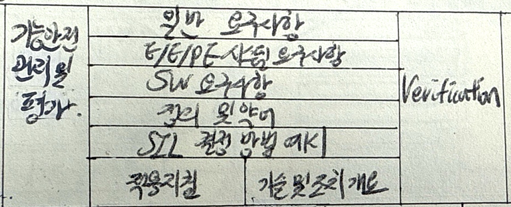
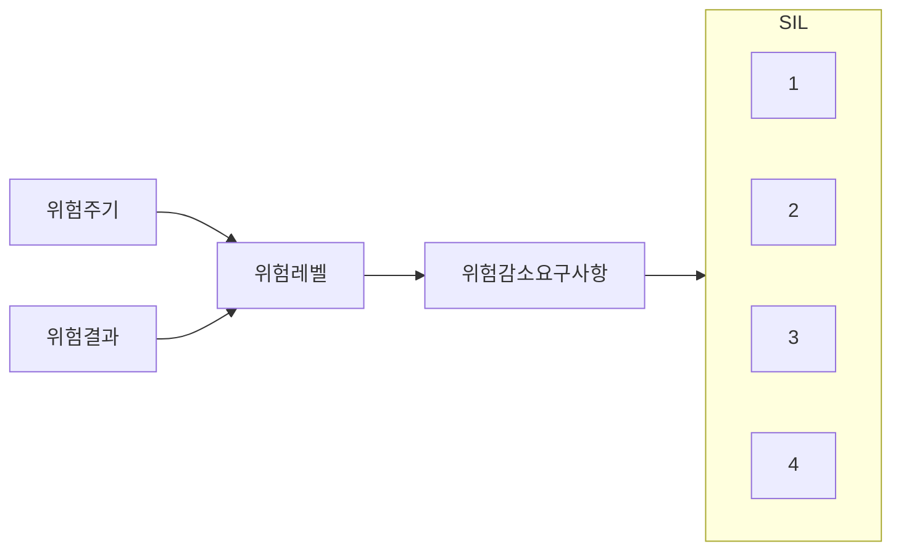
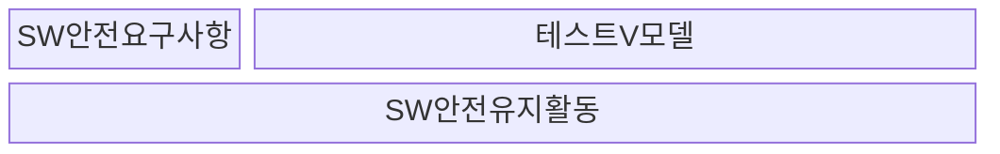

## IEC 61508의 개념

- 산업분야에서 전자, 전기, 프로그래밍 가능 전자 시스템의 기능 안전을 위한 국제 표준으로 위험 분석을 통한 SIL 설정으로 시스템 안전 기능 요구수준 결정
- 인명, 재산 손실 최소화, 법적 규제 요구사항 충족, 안전 설비 신뢰성 향상

## IEC 61508 구성도, 구성요소, 적용방안

### IEC 61508 구성도

### IEC 61508 구성요소

| 구분 | 구성요소 | 내용 |
| --- | --- | --- |
| Part 1 | 일반 요구사항 | 기능 안전 개념, 전체 안전 요구사항 개발, 위험 분석 및 감축 전략 |
| Part 2 | E/E/PE 시스템 요구사항 | 전기/전자/프로그래밍 가능 전자 시스템의 하드웨어 안전 요구사항 및 구현 |
| Part 3 | SW 요구사항 | 안전 관련 소프트웨어 개발, 검증, 유지보수에 대한 요구사항 |
| Part 4 | 정의 및 약어 | 표준에서 사용되는 주요 정의 및 개념 정리 |
| Part 5 | SIL 결정 방법 및 예시 | 안전 무결성 등급(Safety Integrity Level) 결정 방법론 및 예시 |
| Part 6 | 지침 및 적용 사례 | 기능 안전 요구사항을 실무에서 적용하는 방법 및 사례 제공 |
| Part 7 | 개별 기법 및 측정 | 안전성 평가 기법, 신뢰성 분석 및 실무 적용을 위한 기술적 가이드 |

### IEC 61508 주요 유형

| 구분 | 내용 | 비고 |
| --- | --- | --- |
| 하드웨어 안전 무결성 | 환경 요소에 의한 HW 성능 저하, 부품 제작 상의 허용 오차 | 평균 고장 발생률로 측정 가능 |
| 시스템 안전 무결성 | 안전 요구사항 명세, 설계, 구현 오류 관련 휴먼 에러 | 평균 고장 달성률 측정 불가 |

## IEC 61508 안전 무결성 수준

| 수준 | 내용 | 저요구 작동모드 | 고요구 작동모드 |
| --- | --- | --- | --- |
| SIL1 | 경미한 부상, 재산 피해 | $10^{-5} \sim 10^{-4}$ | $10^{-9} \sim 10^{-8}$ |
| SIL2 | 심각한 부상, 재산 피해 | $10^{-4} \sim 10^{-3}$ | $10^{-8} \sim 10^{-7}$ |
| SIL3 | 사망 또는 심각한 환경 피해 | $10^{-3} \sim 10^{-2}$ | $10^{-7} \sim 10^{-6}$ |
| SIL4 | 다수 사망, 대규모 환경 피해 | $10^{-2} \sim 10^{-1}$ | $10^{-6} \sim 10^{-5}$ |

## IEC 61508 고려사항

- SW의 전체 수명주기 동안 기능, 성능 안전을 유지하기 위한 안전 유지활동 필요
