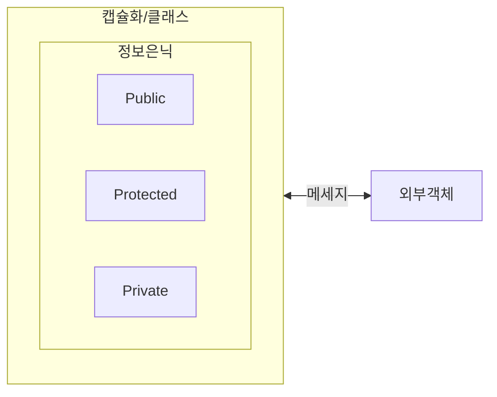

## 정보은닉 개념

- 코드 내부 데이터와 메서드를 숨기고 공개 인터페이스를 통해서만 접근이 가능하도록 하는 객체지향 프로그래밍의 특성
- 외/내부 구현을 나눠 복잡성 제거, 외부로부터의 데이터 보호

## 정보은닉 개념도, 접근제어자 유형, 예시

### 정보은닉 개념도

- 접근제어자를 사용하여 외부객체로부터 데이터 접근 수준 제어

### 접근제어자 유형

| 구분 | 유형 | 상세설명 |
| --- | --- | --- |
| 클래스 | default | 동일 패키지 내 클래스에게 접근 허용 |
| | public | 모든 클래스에서 접근 허용 |
| 속성/메소드 | private | 비공개, 클래스 내 멤버만 접근 허용 |
| | default | 동일 패키지 내 클래스일 경우 접근 허용 |
| | protected | 동일 패키지 또는 상속받은 자식 클래스의 경우 접근 허용 |
| | public | 공개, 모든 클래스에서 접근 허용 |
