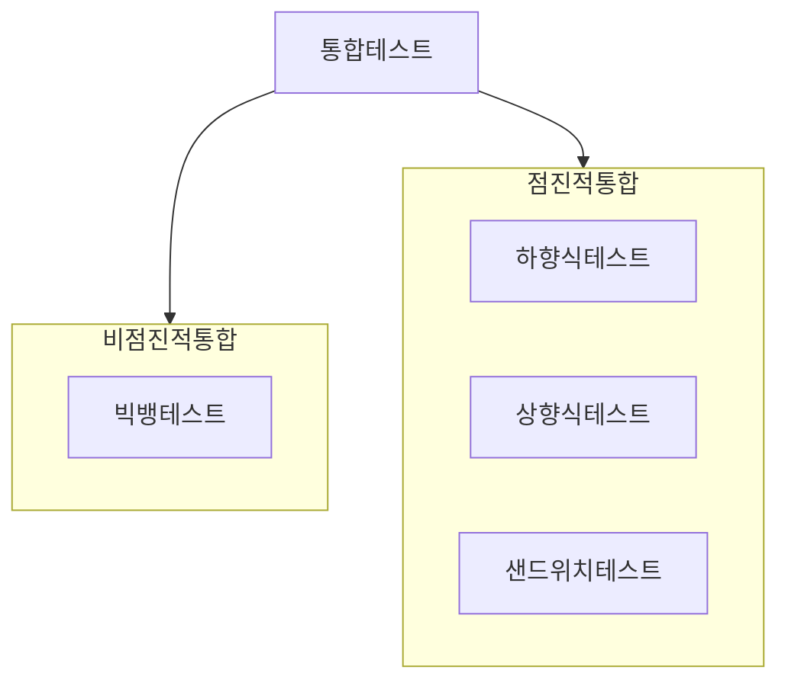
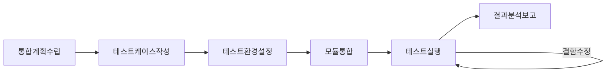

## 통합테스트 개요

### 통합테스트 개념

- 소프트웨어 각 ==모듈 간의== 인터페이스 관련 ==오류 및 결함을 찾아내기 위한 테스트== 방법

### 통합테스트 필요성

- 시스템에서 일부 모듈만 새로 구축하는 경우 안정성을 위해 통합테스트 필요.
- 연결된 외부 모듈의 테스트 환경이 제공되지 않을 경우 상위 모듈이면 테스트 드라이버로 모킹, 하위 모듈이면 테스트 스텁으로 모킹.

## 통합테스트의 절차, 통합방식 비교

### 통합테스트의 절차

- 통합계획 수립시 통합 방식 결정
- 모듈 통합시 테스트 드라이버, 테스트 스텁 사용

### 통합테스트 비점진적 통합방식, 점진적 통합방식 비교

| 구분 | ==비점진적== | ==점진적== |
| --- | --- | --- |
| 개념 | 프로그램을 이루는 각 모듈을 하나로 통합하여 테스트 수행 | 완성모듈을 기존 모듈과 하나식 통합하면서 테스트 수행 |
| 종류 | ==빅뱅테스트== | ==하향식, 상향식, 샌드위치 테스트== |
| 장점 | 소규모 적합, 절차 간단 | 오류 발견용이, 오류시 직전 통합테스트 모듈 확인 |
| 단점 | 오류 및 원인파악 어려움 | 더미모듈, 테스트스텁, 테스트드라이버 ==개발 리소스 필요== |

## 점진적 통합을 위한 테스트 드라이버, 테스트 스텁 비교

| 구분 | ==테스트 드라이버== | ==테스트 스텁== |
| --- | --- | --- |
| 개념 | ==하위모듈 호출, 상위모듈로 데이터 전달==용 가상 모듈 | ==하위모듈 기능 대체== 가상 모듈 |
| 활용 | 하위모듈이 있으나 상위모듈 없는 경우, 상향식 | 상위모듈 있으나 하위모듈 없는 경우, 하향식 |
| 목적 | 하위 모듈 동작 검증 | 상위 모듈 동작 검증 |
| ==예시== | 가입테스트시 인증서버 모듈 | 가입 페이지 없는 경우 기능 모방 |
| - | 서버 가상모듈 제작 | 클라이언트 가상 모듈 제작 |

## 통합테스트 고려사항

- 일관된 ==기준 데이터==를 각 스테이지별로 두어 데이터 정합성으로 인한 테스트 이슈 방지
