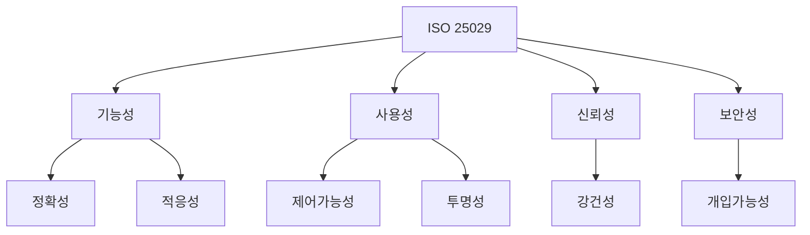

## ISO 25029 개념

- 인공지능 SW시스템의 품질 속성 모델 표준
- 인공지능 SW는 일반적으로 불투명하고 예측이 어려움, 사용 학습 모델 구조, 학습 모델 파라미터 규모, 사용 데이터 양과 질, 학습 절차 등이 모두 품질 영향

## ISO 25029 품질속성 개념도, 세부 내용

### ISO 25029 품질속성 개념도

> 제강적 개투정

- ISO 25000 이하 AI 특징을 반영한 품질 속성 추가

### ISO 25029 품질 속성 세부 내용

| 구분 | 내용 | 비고 |
| --- | --- | --- |
| ==기능 정확성== | 요구되는 정확도로 올바른 출력을 생성하는지 확인 | 학습 모델 종류에 따라 분류, 클러스터링, 회귀 예측 평가 |
| ==기능 적응성== | AI시스템이 배포된 환경에 변화에 따라 행위를 맞춰 나가는 것 | 지속 학습, 확증 편향 |
| ==제어 가능성== | 사용자가 원할 때 작동 중인 AI시스템에 개입 가능 여부 | 자율 주행 |
| ==투명성== | AI 시스템의 정보를 충분히 제공 | 해석 가능성, 설명 가능성 |
| ==강건성== | AI가 편향, 적대적 공격 등을 감내할 수 있는 환경 변화의 정도 | 운영 신뢰성 |
| ==개입 가능성== | 쉽게 AI시스템을 운용 및 제어 가능하도록 인터페이스 설계가 되어있는지의 여부 | 인간중심적 |

### ISO 25029 품질 속성 시험 기법

| 구분 | 시험 기법 | 내용 |
| --- | --- | --- |
| ==기능 정확성== | ==분류== | 학습 당시 없던 새로운 데이터 입력시 데이터가 어디에 속하는지 분류 |
| - | - | ==Accuracy, Precision, Recall, ROC== |
| - | ==회귀 분석== | 시계열 데이터에 대해 직선, 곡선을 추론하는 기법 |
| - | - | ==평균절대오차MAE, 평균제곱오차MSE, 평균제곱근오차RMSE== |
| - | ==군집화== | 고객 분할, 이미지 분할, 비정상적 탐지 군집화 |
| - | - | ==Purity, NMI, RI== |
| ==강건성== | ==악의적 입력 생성== | 화이트박스기반 손실 함수 ==기울기 반대방향==으로 ==노이즈를 주어 오판 유도== |
| - | - | 블랙박스기반 학습 모델을 ==대체품으로 만들어 악의적 입력== 활용 |
| - | ==분포 외 데이터 처리== | 학습 데이터와 동떨어진 데이터 ==OOD 검증== |
| - | ==블랙박스 시험 기법== | ==메타몰픽 테스트==, 초기 테스트 사례와 후속 테스트 사례 입력 사이의 ==편차를 검증 (A/B)== |
| - | ==화이트박스 시험 기법== | ==CNN기반 커버리지==, 뉴런 커버리지, 부호 변화 커버리지, 값 변화 커버리지, 부호-부호 커버리지 |
| - | - | ==RNN기반 커버리지==, ==셀 스테이트==(반대단어), ==히든 스테이트==(유사단어) |
