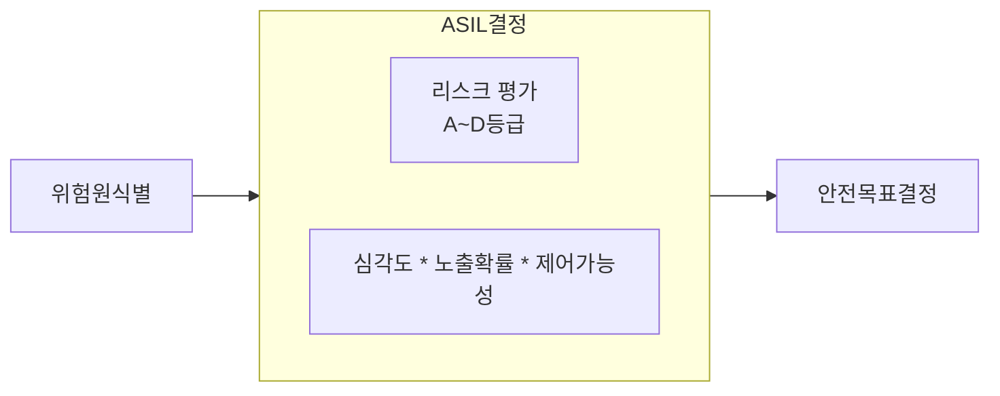
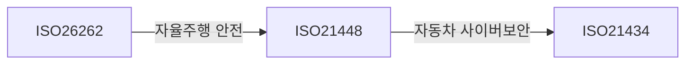

## ISO 26262 개념

- 자동차에 탑재된 전기전자시스템의 오작동으로 인해 발생할 수 있는 사고를 방지하기 위한 자동차 기능안전 국제 표준
- 전기차, 자율주행, E2E AI 등 신기술 도입으로 SW 비준하는 전기전자 제어 시스템의 안전성 확보 필요

## ISO 26262 구성도, 구성요소

### ISO 26262 구성요소

| 파트 | 구성요소 | 상세설명 |
| --- | --- | --- |
| Part1 | 용어 | ISO26262 사용용어 및 약어 정의 |
| Part2 | 기능안전 | 프로젝트 전반 안전성 관리 요구사항 정의 |
| Part3 | 구상단계 | 위험분석(HARA) 및 안전 목표 설정 |
| Part4 | 시스템 레벨 제품 개발 | 시스템 아키텍처 설계, 기술적 안전 요구사항, 테스트 요구사항 |
| Part5 | HW레벨 제품 개발 | HW설계, 아키텍처 평가, 검증 요구사항 정의 |
| Part6 | SW레벨 제품 개발 | SW안전 요구사항, ASPICE와 연계하여 SW개발 프로세스 관리 |
| Part7 | 생산 및 운영 | 차량 생산, 운영 중 발생가능한 위험관리와 폐기 안전 절차 |
| Part8 | 지원 프로세스 | 형상 관리, 변경 관리, 문서화 등의 지원 절차 |
| Part9 | ASIL 및 안전 중심 분석 | ASIL 평가 방법론과 안전 구성요소 간 종속 조건 정의 |
| Part10 | 가이드라인 | 표준 적용 시 참고할 수 있는 추가 가이드라인 제공 |
| Part11 | 반도체 산업 적용 가이드라인 | 반도체 제조업체를 위한 세부 정보 제공 |
| Part12 | 모터사이클 적용 요구사항 | 모터사이클에 특화된 기능 안전 요구사항 |

## ASIL 평가 절차, ASIL 등급

### ASIL 평가 절차도

### ASIL 등급

| 등급 | 내용 | 비고 |
| --- | --- | --- |
| ASIL A | 상대적 낮은 위험, 기본 안전조치 필요 | 경상 |
| ASIL B | 중간 수준 위험, 추가적인 안전조치 필요 | 중상 |
| ASIL C | 높은 위험 수준, 엄격한 안전조치 필요 | 사망 |
| ASIL D | 매우 높은 위험 수준, 최고 수준의 안전조치 필요 | 다수 사망 |

## 자율주행시대의 자동차 안전 고려사항

- ISO 21448을 통하여 자율주행시 알려진, 알려지지 않은 시나리오를 평가하여 위험 감소
- ISO 21434를 통하여 개발단계의 사이버보안에서부터 사고 대응, 복구, 모니터링 및 공급망 관리 절차 강화
