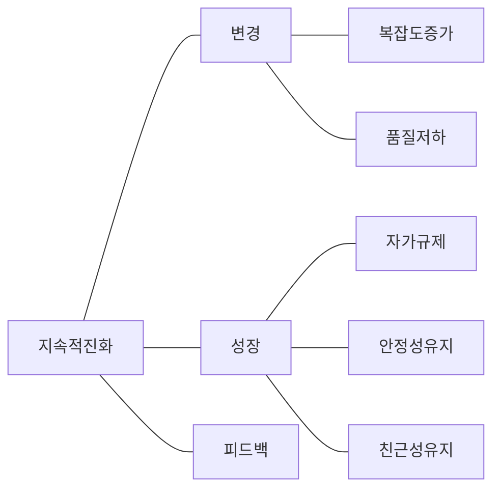

## 소프트웨어 진화 법칙 개요

### 소프트웨어 진화 법칙 개념

- 대부분의 소프트웨어가 존재하는 동안 ==변경이 일반적==이며, ==지속적으로 유지되기 위해 준수해야하는 법칙==
- 품질관리와 변경관리의 중요성 강조, 유지보수 비용증가에 따른 관리전략 수립을 위해 필요

### 소프트웨어 진화 법칙 필요성

- SW 변화의 특성을 이해하여 유지보수, 변경관리, 형산관리, 품질 통제의 중요 모델로 반영할 수 있으므로 효과적인 유지보수 및 변화관리 가능.

## 소프트웨어 진화 법칙 개념도, 핵심요소, 적용방안

### 소프트웨어 진화 법칙 개념도

### 소프트웨어 진화 법칙 핵심요소

| 구분 | 법칙 | 내용 |
| --- | --- | --- |
| 완전유지관리 | 조직적 안전성 | 평균 유효한 글로벌 작업률은 제품 수명 기간동안 변하지 않음 |
| | 지속적인 성장 | 사용자를 만족시키기 위해 기능적 성장 필요 |
| 적응유지관리 | 지속적인 변화 | SW는 지속적으로 적응하고 변화해야함 |
| | 자기 규제 | 시스템 진화는 제품의 배포와 프로세스 측정으로 자체 조절됨 |
| | 피드백 시스템 | 진화 프로세스는 다중 레벨, 다중 에이전프 피드백 시스템이여야함 |
| 수리유지관리 | 품질 저하 | 변경이 엄격하게 유지 관리되고 적응하지 않으면 품질 감소 |
| 예방유지관리 | 증가하는 복잡성 | 시스템이 발전할 때 관리하지 않으면 복잡성 증가 |
| | 친숙도 보존 | 사용자는 만족스러운 진화가 될 수 있게 내용과 행동을 숙달해야함 |

- SW 변화 특성을 이해하고, 유지보수, 변경관리, 형상관리, 품질 통제의 중요 모델로 반영

### 소프트웨어 진화 법칙 적용방안

| 구분 | 방안 | 비고 |
| --- | --- | --- |
| 요구 | 사용자 요구 지속적 수집, 분석 | 요구관리 툴 |
| 설계 | 모듈화된 설계를 통한 변경 용이성 | 컴포넌트화 |
| 구현 | 변경관리 프로세스 통한 코드 관리 | VCS 활용 |
| 테스트 | 자동화된 테스트 통한 품질 검증 | Continuous Test |
| 배포 | 점진적 배포를 통한 안정적 대응 | 블루-그린 배포 |
| 유지보수 | 지속적 모니터링과 피드백 수집, 개선 | CMS |
| 폐기 | SW 수명 종료시 폐기 절차 수행 | 데이터 마이그레이션 |

## 소프트웨어 진화법칙 추가적인 고려사항

- 신기술 도입과 기존 기술의 진화를 지속적으로 모니터링하여 SW 기술 부채를 최소화하는 활동 필요
