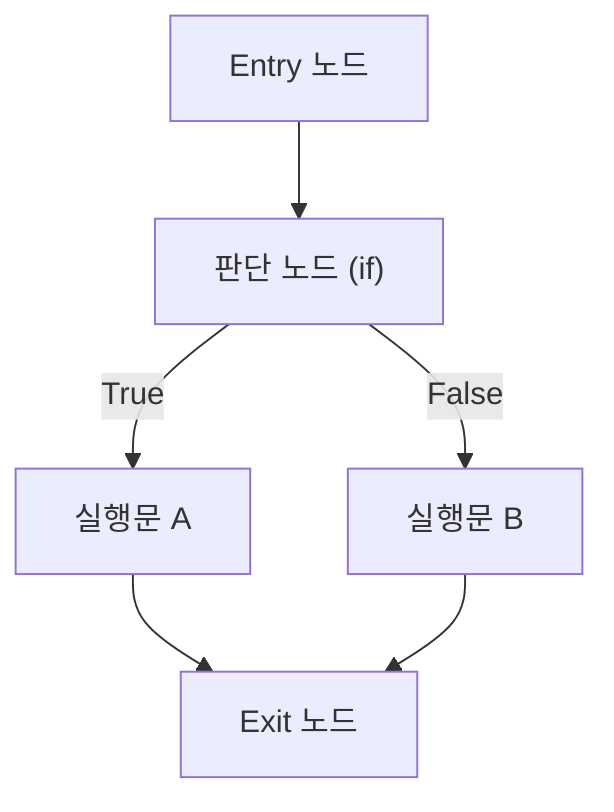

## 맥케이브 순환복잡도 개념

- 제어 흐름 그래프(Control Flow Graph)를 기반으로 프로그램 내 ==선형 독립 실행 경로(Linearly Independent Path)의 수==를 정량 측정하는 정적 소프트웨어 복잡도 지표.
- ==기본 경로 테스트(Basis Path Testing)==의 최소 테스트 케이스 수를 결정하는 상한 기준으로, 화이트박스 테스트 설계와 유지보수성 평가에 활용.

### 맥케이브 순환복잡도 개념도

- 위 그래프는 간선 수 $E=5$, 노드 수 $N=5$, 판단 노드 수 $D=1$이며 단일 모듈($P=1$)이므로 $V(G)=E-N+2P=5-5+2=2$로 산출.

## 맥케이브 순환복잡도 구성도, 핵심요소, 적용방안

### 맥케이브 순환복잡도 구성도

- 소스코드의 제어 흐름을 노드(명령 구문)와 간선(분기 경로)으로 추상화하여 분기 구조를 시각화.

### 맥케이브 순환복잡도 핵심요소

| 구분 | 핵심요소 | 설명 |
| --- | --- | --- |
| 간선-노드 방식 | $V(G)=E-N+2P$ | 간선 수 $E$, 노드 수 $N$, 연결 요소 수 $P$ (단일 모듈은 $P=1$) 기반 일반식 |
| 판단 노드 방식 | $V(G)=D+1$ | 판단(Predicate) 노드 수 $D$ (if, while, for, case 등) 기반의 간소식 |
| 폐영역 방식 | $V(G)=R$ | 평면 그래프가 분할하는 폐영역과 외부 영역의 합인 총 영역 수 $R$ 과 매핑 |
| 복잡도 등급 | $V(G)\le 10$ | 통상 10 이하 안정, 11~20 보통, 21~50 고위험, 50 초과 리팩토링 대상 |

### 맥케이브 순환복잡도 적용방안

| 구분 | 내용 | 비고 |
| --- | --- | --- |
| 공공 | 공공 SW 사업 정적 감리 시 소스코드 품질 요구사항 임계치로 반영 | 감리 점검 기준 |
| 금융 | 계정계 핵심 거래 모듈 단위 복잡도를 $V(G)\le 5$ 로 엄격 통제 | 결함 최소화 |
| 민간 | CI/CD 정적 분석 도구(SonarQube 등) 품질 게이트 규칙으로 자동 통제 | 파이프라인 연동 |

## 맥케이브 순환복잡도와 인지 복잡도 비교

| 구분 | 맥케이브 순환복잡도 | 인지 복잡도(Cognitive Complexity) |
| --- | --- | --- |
| 측정 목적 | 기계적 테스트 경로 충분성·구조 복잡성 측정 | 코드를 읽고 이해하는 정신적 부하 측정 |
| 측정 요소 | 제어 흐름 분기 수의 단순 합산 | 흐름 단절·중첩 깊이·논리 가중치 산출 |
| 중첩 가중치 | 미반영 (중첩 if와 순차 if를 동일 측정) | 반영 (중첩 깊이에 비례 가산) |
| 주요 활용 | 기본 경로 테스트 케이스 설계 | 가독성 향상·리팩토링 타깃 식별 |

- 시사점: 순환복잡도는 테스트 경로 설계, 인지 복잡도는 유지보수 생산성에 특화되어 상호 보완적으로 운용해야 함.

## 맥케이브 순환복잡도 도입을 위한 고려사항

| 구분 | 문제점 | 해결방안 |
| --- | --- | --- |
| 형식적 측정 | 수치 충족만을 위한 비정상적 코드 분할 왜곡 발생 | 인지 복잡도 혼용 정책으로 가독성 함께 통제 |
| 비용 부담 | 과도한 경로로 테스트 케이스 설계·실행 비용 급증 | 핵심 로직 선택 적용·정적 분석 자동화로 공수 절감 |
| 설계 경직성 | 대용량 파싱 등 본질적 분기 로직에서 오탐 발생 | 도메인별 복잡도 임계치(Threshold) 유연 정의 |

- 복잡도 지표는 정적 분석·형상 통제의 핵심 도구로 SW 전 생명주기에 걸쳐 체계적으로 관리되어야 함.

## 참조

- T. J. McCabe, "A Complexity Measure," IEEE Transactions on Software Engineering, vol. SE-2, no. 4, pp. 308-320, 1976. https://doi.org/10.1109/TSE.1976.233837
- NIST, "Structured Testing: A Testing Methodology Using the Cyclomatic Complexity Metric," NIST Special Publication 500-235. https://www.nist.gov/publications/structured-testing-testing-methodology-using-cyclomatic-complexity-metric
