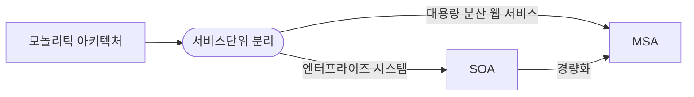
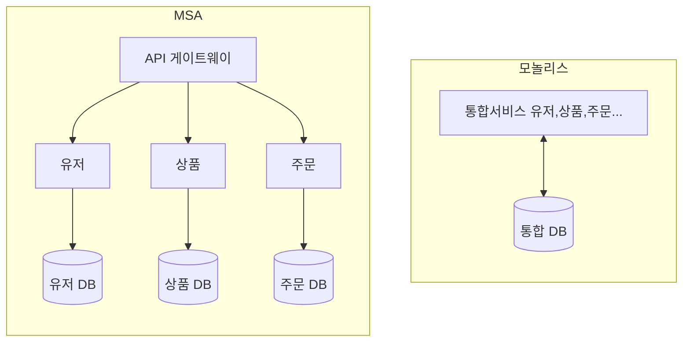

## MSA, 모놀리틱 아키텍처 개념

- 모놀리틱 아키텍처에서 비지니스 프로세스를 독립된 서비스로 분리한 SOA로 전환, SOA의 ESB 부하집중, 기술스택 일원화 문제를 해결하기 위해 MSA 등장

## MSA, 모놀리틱 아키텍처 구성도, 구성요소, 적용방안

### MSA, 모놀리틱 아키텍처 구성도

- 하나의 어플리케이션을 여러 개의 서비스로 나눠 조합하여 서비스를 제공

### MSA, 모놀리틱 아키텍처 구성요소

| 구분 | 모놀리틱 | MSA |
| --- | --- | --- |
| 모듈성 | 영향도, 의존성 높음 | 서비스 간 의존성 낮음 |
| 유지보수성 | 규모가 커질수록 어려움 | 개별 서비스 |
| 확장성 | 부분 Scale-out 어려움 | 서비스 단위 유연한 Scale-out |
| 조직 | 기능 중심 조직 구조 | 비지니스 중심 DevOps 구조 |
| 장점 | 배포, 테스트 표준화된 방식으로 관리 용이 | 서비스 단위 빠른 개발, 배포 용이 |
| 단점 | One Codebase로 의존성이 높아 신규 개발 어려움 | 분산시스템에서 트랜잭션 관리 어려움 |

### MSA 적용 방안

- Istio 등 서비스 메쉬를 도입하여 MSA 간 서비스 디스커버리, 라우팅, 보안, 로드밸런싱 등 처리

## MSA 도입시 고려사항

- MSA 전환시 네트워크 지연시간이 추가되므로 성능에 민감한 시스템일 경우 도입을 신중히 검토해야함
