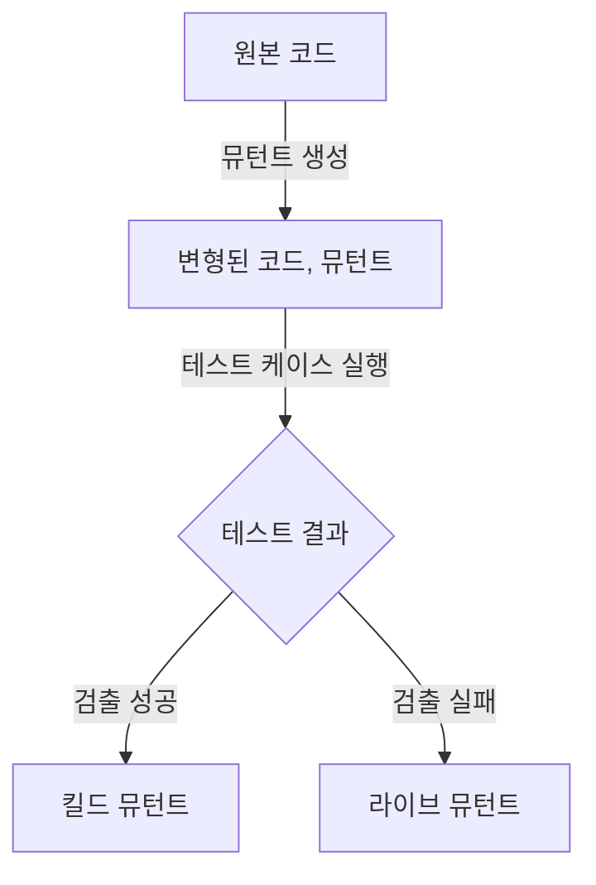

# 뮤테이션 테스트에 대한 자세한 설명

## 뮤테이션 테스트 개념

- 소스 ==코드의 일부를 의도적으로 변경==하여 테스트 케이스가 이 ==변경된 코드를 검출할 수 있는지 확인==하는 화이트박스 테스트 기법
- 테스트 케이스 유효성 검증, 코드 품질 향상, 테스트 커버리지 보완, 버그 발견

## 뮤테이션 테스트 구성도, 구성요소, 적용방안

### 뮤테이션 테스트 구성도

### 뮤테이션 테스트 구성요소

| 구분 | 내용 | 비고 |
|---|---|---|
| 원본 코드 | 테스트할 소스 코드 | SW 실제 기능을 수행하는 코드 |
| 뮤턴트 | 원본 코드를 변형하여 만든 코드 | 의도적으로 결함을 삽입한 코드 |
| 테스트 케이스 | 원본 코드와 뮤턴트를 검증하기 위한 테스트 시나리오 | 다양한 상황을 가정하여 작성된 테스트 |
| 킬드 뮤턴트 | 테스트 케이스가 검출한 뮤턴트 | 뮤턴트를 정확히 찾아내는 테스트 케이스 |
| 라이브 뮤턴트 | 테스트 케이스가 검출하지 못한 뮤턴트 | 테스트 케이스의 수정이 필요 |

### 뮤테이션 테스트 오퍼레이터

| 구분 | 내용 | 비고 |
|---|---|---|
| 연산자 교체 | 코드 내의 연산자를 다른 연산자로 교체 | `+`를 `-`로, `>`를 `<`로 변경 |
| 상수 값 변경 | 코드 내의 상수 값을 다른 값으로 변경 | `int x = 5;`를 `int x = 10;`으로 변경 |
| 조건문 변경 | 조건문의 논리적 또는 비교 연산자를 변경 | `if (a > b)`를 `if (a < b)`로 변경 |
| 논리적 연산자 변경 | 논리적 연산자를 다른 연산자로 교체 | `and`를 `or`로 변경 |
| 제어 구조 변경 | 루프나 조건문 등의 제어 구조를 변경 | `for` 루프를 `while` 루프로 변경 |
| 문장 삭제 | 코드의 특정 문장을 삭제 |  변수 할당 문장 또는 조건문 삭제 |
| 반환 값 변경 | 메서드의 반환 값을 다른 값으로 변경 | `return x;`를 `return -x;`로 변경 |

### 뮤테이션 테스트시 고려사항

- 많은 뮤턴트 생성으로 인한 높은 컴퓨팅 자원과 결과해석에 대한 인적 리소스 필요
