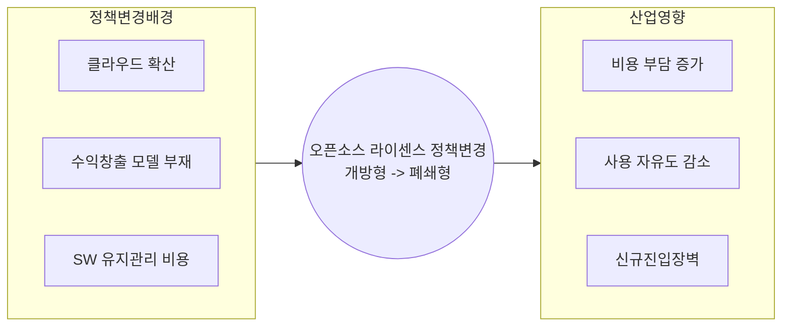

## 오픈소스 라이센스 정책변경 개요

- 개방형 S/W 라이선스는 사용자가 자유롭게 SW 를 사용, 수정, 배포 가능하여 제약이 적은 오픈소스 라이선스
- 페쇄형 S/W 라이선스는 SW 사용, 수정, 배포가 엄격히 제한되어 저작권자 저작물 독점권리 보장가능 라이선스

## 오픈소스 라이센스 정책변경 배경

### 환경 및 경제 측면

| 구분 | 배경 | 설명 |
| --- | --- | --- |
| 환경적 측면 | 클라우드 환경확산 | 클라우드 컴퓨팅 대중화로 CSP가 오픈소스를 상업적으로 이용 오픈소스 개발자들은 대형 CSP 업체에 의한 상업적 도구 전략 |
| | 기술의 진보와 SW 복잡성 증가 | 현재 SW의 복잡성 증가는 단순한 자유로운 사용 장려 제한 복잡한 SW 유저비용 관리로 폐쇄형으로 지속적 유지보수 |
| 경제적 측면 | 수익 창출모델 변화 | 오픈소스 SW 기반 비즈니스 모델 확산 폐쇄형 라이선스를 통한 라이선스 비용부과로 수익창출 가능 |
| | 대기업의 SW 독점 방지 | 대형 IT 기업의 오픈소스 SW로 제품개발/이익독점 방지 중소 IT 기업의 공정한 경쟁 환경 조성 가능 |

### 기술 및 운영 측면

| 구분 | 배경 | 설명 |
| --- | --- | --- |
| 기술적 측면 | 보안 및 품질 유지 | 개방형 라이선스는 누구나 사용 가능하나 보안 및 품질 이슈 폐쇄형으로 개발자 코드 품질 유지 및 보안 허점 감소 가능 |
| | 특정 플랫폼 종속성 방지 | 오픈소스가 과도하게 사용돼 해당 기업에 종속 우려 라이선스의 제한으로 지나친 기술적 종속 방지 가능 |
| 운영적 측면 | SW 유지관리 비용 확보 가능 | 대규모 오픈소스 프로젝트는 지속적 유지관리 필요 폐쇄형 라이선스를 통해 유지관리 비용 충당 가능 |
| | 사용 조건 관리 | 오픈소스 SW 상업적 제품을 개발조건 관리 곤란 폐쇄형 통해 사용제한 및 통제가 가능 |

## 폐쇄형 라이센스로의 전환 영향

| 구분 | 사례 | 영향 |
| --- | --- | --- |
| 오픈소스 커뮤니티 분열 | Redis의 라이선스 변경 | Redis 일부 멤버들은 새로운 라이선스가 오픈소스 정신을 위배한다고 비판, 포크된 Redis를 배포하는 커뮤니티 활동 증가 KeyDB로 포크 프로젝트 진행 |
| | ElasticSearch 라이선스 변경 | AWS 등 클라우드 서비스 업체가 ElasticSearch 라이선스를 변경하며 관련 서비스에서 오픈소스 독점화 우려 Open Search로 포크 프로젝트 진행 |
| 기업의 오픈소스 활용 정책 변화 | Oracle의 MySQL 인수 후 라이선스 변경 | MySQL의 오픈소스 라이선스 활용에 제한이 발생하며, 기업형 라이선스 비용이 증가 MariaDB의 활용 증가 |
| | MongoDB 라이선스 변경 | 클라우드 네이티브 환경에서 MongoDB 사용이 제한되며, 관련 서비스를 제한적으로 사용하도록 정책 변경 FerretDB로 포크 프로젝트 진행 |
