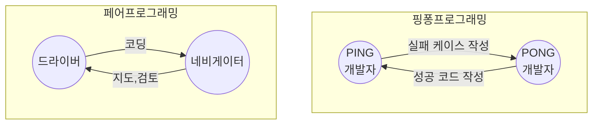

## 페어 프로그래밍 개념

- XP 개발 방법론에서 개발자 고립과 낮은 생산성 문제를 해결하기 위해 페어프로그래밍 기법 등장, 애자일 방법론에서 TDD 기반의 핑퐁 프래밍 기법으로 발전.
- 오류에 빠른 대응 가능, 코드에 대한 책임 분담으로 실수 방지 가능

## 페어 프로그래밍, 핑퐁 프로그래밍의 개념도, 구성요소, 적용방안

### 페어 프로그래밍, 핑퐁 프로그래밍의 개념도

### 페어 프로그래밍, 핑퐁 프로그래밍 구성요소 비교

| 구분 | 페어 프로그래밍 | 핑퐁 프로그래밍 |
| --- | --- | --- |
| 개념 | 두 개발자가 한 컴퓨터에서 개발하는 프로그래밍 방식 | 두 개발자가 번갈아가며 테스트와 코드 작성 |
| 역할 | 드라이버, 네비게이터 | 테스트 작성자, 코드 작성자 |
| 특징 | 코드 품질 향상, 코드 리뷰 | TDD 촉진 |
| 장점 | 오류 감소, 지식 공유, 생산성 향상 | 테스트와 코드 작성의 연계 |
| 단점 | 의사소통 비용 발생 | 잦은 인터럽트 발생 |

### 페어 프로그래밍 적용방안

| 구분 | 방안 | 비고 |
| --- | --- | --- |
| 숙련도가 다른 개발자 | 시니어-주니어 페어로 네비게이터-드라이버 역할 수행 | 주니어의 빠른 성장 기대 |
| 신기술 학습 | 새로운 기술 적용시 여러 관점 고려 가능 | 학습효과 극대화 |
| 문제 해결 | 다양한 접근 방식으로 빠른 이슈 해결 | 역할 교체 |

## 페어 프로그래밍시 고려사항

- 서로 신뢰하고 존중하는 분위기가 선행되어야 페어 프로그래밍시 커뮤니케이션 비용 대비 생산성 효과 극대화
