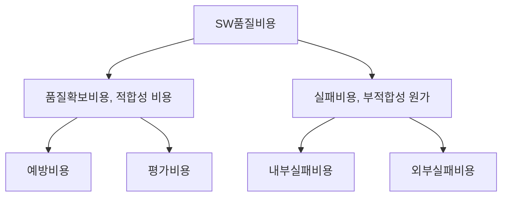

## 품질비용 항목의 개념

- SW제품의 품질을 유지하고, 향상시키기 위해 설계부터 유지보수 단계까지 발생하는 모든 비용
- SW개발 초기 단계부터 품질 비용 항목을 관리해야 후속 단계에서 결함 수정 및 유지보수 비용 절감 가능
- 품질비용을 투자하면 원가가 줄어든다는 것은 6시그마(DMAIC)에서 증명

## 품질비용항목 개념도, 구성요소, 주요사례

### 품질비용항목 개념도

- 예방, 평가 비용을 높혀 실패비용을 줄이는 것이 품질비용 관리의 목표

### 품질비용항목 구성요소

> 예평내외

| 구분 | 내용 | 비고 |
| --- | --- | --- |
| ==예방비용== | 결함 예방 투입 비용 | 교육, 훈련, 프로세스 개선 |
| ==평가비용== | 제품 품질 평가 및 검증 비용 | 테스트, 리뷰, 감리 |
| ==내부실패비용== | 개발단계에서 발견된 결함 수정 비용 | 재작업, 수정, 폐기 |
| ==외부실패비용== | 출시 후 결함 발생 비용 | 고객지원, 환불, 소송 |

### 품질비용항목 주요사례

| 구분 | 사례 | 비고 |
| --- | --- | --- |
| 예방비용 | 프로젝트 및 자원관리 | 품질 계획, 수립, 통제, 형상, 보안 관리 |
| - | 예방품질활동 | 프로세스 점검, 산출물 검토, 내부QA |
| 평가비용 | 평가품질활동 | 장비검수, 피어리뷰, 코드리뷰 |
| - | 테스트 | 단위, 통합, 시스템, 인수 |
| 내부실패비용 | 내부실패 관리, 품질활동 | 추가 작업비용, 조치 |
| - | 테스트 결함 조치 | 테스트 후 결함 조치 |
| 외부실패비용 | 결함 처리 조치 | 이미지 손실, 고객불만 처리 |
| - | 납기 지연 대응 | 프로젝트 지연 대응, 장애 복구 |

- 품질비용은 예방, 평가, 내부실패, 외부실패 순으로 사용 권장

## 품질비용 고려사항

- 납기일을 준수하기 위해 테스트기간을 줄이고 있는 현황을 해결하기 위해, 프로젝트 계획 단계에서부터 품질비용을 고려한 기간산정 필요.
