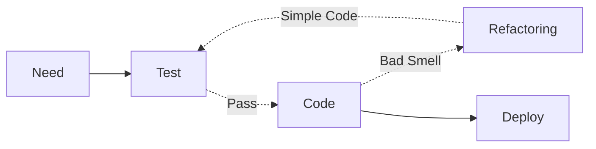

> 129

## 리팩토링 개요

### 리팩토링 개념

- 외부적 기능은 수정하지 않고, 내부를 단순화하여 유지보수성을 향상시키는 기법

### 리팩토링 필요성

- 애자일 개발 방법론의 도입으로 TDD를 기반으로 코드스멜을 제거하기 위한 리팩토링의 중요성이 강조됨.

## 리팩토링의 개념도, 세부절차, 적용방안

### 리팩토링의 개념도

### 리팩토링의 세부절차

| 구분 | 내용 | 비고 |
| ---- | ---- | ---- |
| 리팩토링 대상선정    | 코드스멜을 통해 개선 필요 코드 선정    | 중복 코드, 긴 메소드명 등    |
| 테스트코드 작성    | 로직의 기대결과를 테스트로 작성    | TDD    |
| 리팩토링    | 리팩토링 후 코드스멜 발생시 반복  | 메소드 분리 등    |

### 리팩토링의 적용방안

| 구분          | 내용 | 비고 |
| ------------- | ---- | ---- |
| 결합도 측면 | 이동    | 패키지 재구성, 메소드 이동    |
| - | 분리 | 기능 분리 별도 클래스화, 인터페이스 분리 |
| 응집도 측면     | 일반화    | 중복 메소드 제거    |
| - | 통합 | 공통 필드 수퍼 클래스 통합 |
| 가독성 측면     | 재명명    | 목적과 이름이 다른 경우    |
| - | 주석 | 테스트코드만으로 설명할 수 없는 경우 |

## 리팩토링시 고려사항

- sonarlint, eslint 등 정적분석 도구를 활용하여 가독성, 복잡도 등 코드스멜 감지 및 수정 자동화
