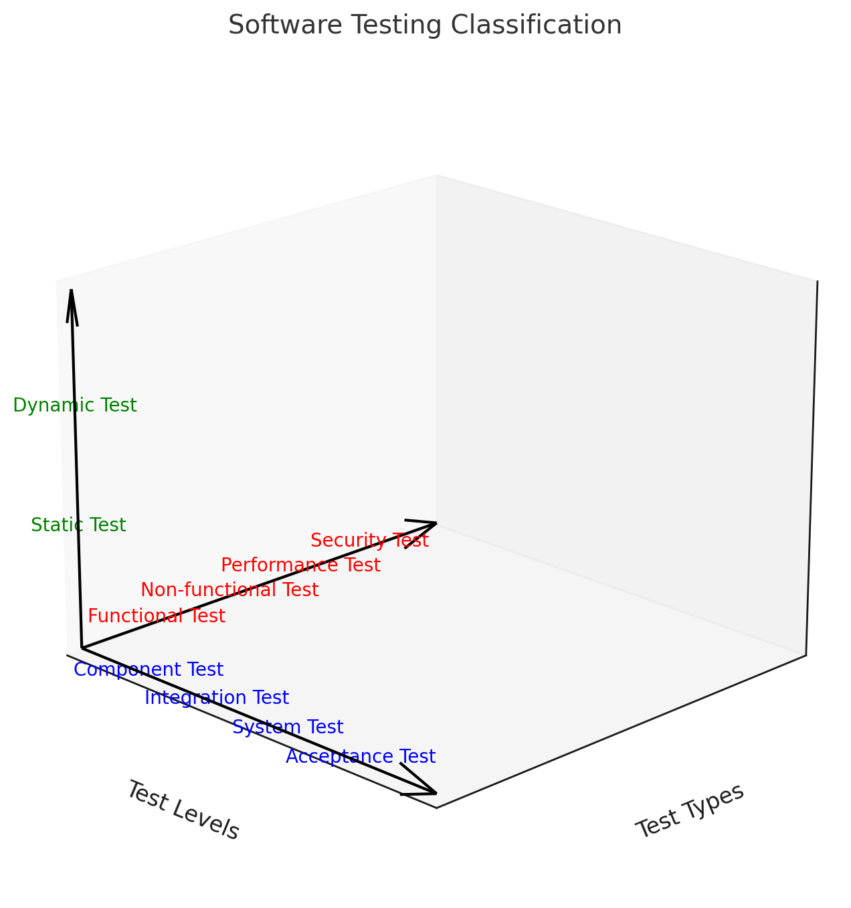

## 소프트웨어 테스트의 종류

### 소프트웨어 테스트 분류

- 소프트웨어 테스트는 테스트 레벨, 테스트 유형, 테스트 설계 기법에 따라 분류

### 소프트웨어 테스트 분류 상세설명

| 분류 | 테스트 종류 | 설명 |
| --- | --- | --- |
| **테스트 레벨** | 컴포넌트/단위 테스트 | 각각의 컴포넌트를 테스트 |
| | 통합 테스트 | 컴포넌트 간의 인터페이스 테스트 |
| | 시스템 테스트 | 전체 시스템의 목적 만족 여부 테스트 |
| | 인수 테스트 | 사용자의 요구사항 만족 여부 테스트 |
| **테스트 설계** | 명세 기반 테스트 | 명세를 바탕으로 테스트케이스 생성 |
| | 구조 기반 테스트 | 프로그램 코드를 기반으로 테스트케이스 생성 |
| | 경험 기반 테스트 | 테스트의 경험을 기반으로 테스트케이스 생성 |
| 정적테스트 | 리뷰 | 산출물 검토, 프로젝트 진행사항 점검 |
| | 정적 분석 | 자동화된 도구로 결함을 검출 및 점검 |
| **테스트 유형** | 기능 테스트 | 사용자의 요구사항 충족 여부 검출 |
| 비기능테스트 | 기능 적합성 테스트 | 사용자의 요구사항 만족 기능 제공 여부 테스트 |
| | 성능 효율성 테스트 | 시스템의 응답시간/처리량 테스트 |
| | 호환성 테스트 | 다른 시스템과의 상호 연동성/공존성 테스트 |
| | 보안성 테스트 | 시스템의 보안성 점검을 위한 능동 테스트 |
| | 사용성 테스트 | 사용자가 시스템을 효율적으로 용이성 테스트 |
| | 유지보수성 테스트 | 규정된 조건/기간에 오동작 없이 수행능력 테스트 |
| | 이식성 테스트 | 다양한 환경에서 운영가능 여부 테스트 |

## 신뢰성 테스트, 이식성 테스트

### 신뢰성 테스트

- 소프트웨어가 정해진 조건 하에서 일정 기간동안 정상적으로 작동하는지를 확인하는 테스트

| 분류 | 종류 | 설명 |
| --- | --- | --- |
| 목적 | 오류 및 결함 발견 | 장시간 사용 시 발생할 수 있는 잠재적인 오류와 결함을 조기에 발견하여 수정 |
| | 시스템 안정성 보장 | 다양한 환경과 조건에서 시스템이 안정적으로 작동하는지 확인하여 신뢰성을 보장 |
| | 품질 향상 | 신뢰성 테스트를 통해 발견된 문제를 개선함으로써 소프트웨어 품질을 높이고 사용자 만족도 향상 |
| 종류 | 부하 테스트 (Load Testing) | 시스템에 예상되는 최대 부하를 가하여 성능과 안정성 확인 |
| | 스트레스 테스트 (Stress Testing) | 시스템의 한계를 넘는 부하를 가하여 얼마나 잘 버티는지, 실패 시 어떻게 복구되는지 평가 |
| | 지속적 테스트 (Soak Testing) | 장시간동안 시스템을 가동하여 장기적인 안정성과 메모리 누수 등의 문제를 발견 |
| 절차 | 계획 수립 | 테스트 목적, 범위, 방법, 성공 기준 정의 |
| | 환경 구성 | 테스트 환경과 유사한 테스트 환경 구성 |
| | 시나리오 작성 | 다양한 시나리오를 통해 시스템의 신뢰성 평가 |
| | 실행 | 계획된 시나리오에 따라 테스트 수행 |
| | 결과 분석 및 보고 | 결과 분석을 통해 문제를 발견하고 해결 방안 제시 |

### 이식성 테스트

- 소프트웨어가 다양한 환경에서 동일하게 작동하는지 확인하는 테스트

| 분류 | 항목 | 설명 |
| --- | --- | --- |
| 목적 | 호환성 확인 | 소프트웨어가 다양한 플랫폼과 환경에서 호환성을 유지하도록 보장 |
| | 사용자 경험 일관성 유지 | 여러 환경에서 동일한 사용자 경험을 제공하여 사용자의 만족도 향상 |
| | 시장 범위 확대 | 다양한 환경에서 작동하는 소프트웨어를 통해 더 넓은 시장에 접근성 보장 |
| 종류 | 하드웨어 독립성 테스트 | 다양한 하드웨어 환경에서 소프트웨어가 정상적으로 작동하는지 확인 |
| | 운영체제 독립성 테스트 | 서로 다른 운영 체제에서 소프트웨어의 호환성 평가 |
| | 브라우저 독립성 테스트 | 웹 애플리케이션의 다양한 브라우저에서 동일한 기능이 작동하는지 확인 |
| | 언어 및 지역 독립성 테스트 | 다국어 지원 소프트웨어의 다양한 언어 및 지역 설정에 서서히 작동하는지 평가 |
| 고려 사항 | 테스트 환경 구축의 어려움 | 다양한 플랫폼과 환경을 모두 구성하는 난이도 증가 |
| | 테스트 시간 및 비용 | 시간과 비용이 많이 소요 |
| | 복잡성 증가 | 다양한 테스트 케이스와 시나리오를 구성하는 과정에서 복잡성이 증가 |
