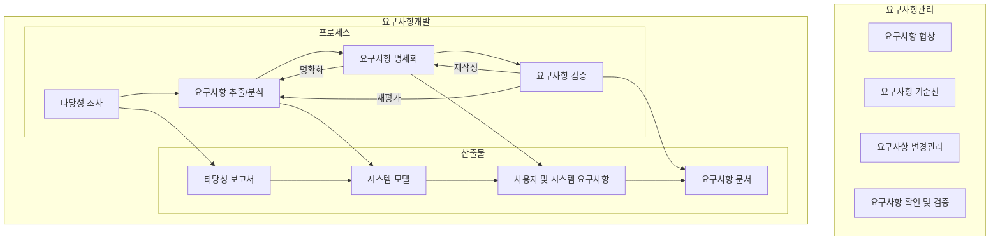

## 요구공학 개념

- 시스템의 개발, 변경의 목적(What)을 식별하기 위해 이해관계자들의 요구를 이해 및 조정하여 체계적으로 수집, 분석, 명세화, 확인하는 공정 또는 학문
- 비지니스 연속성, 확장성 / 비용절감, 효율성 / 기능 구현 완정성, 오류율 감소 / 조직구성원 이해관계자 만족도, 이해도 증가, 생산성 향상

## 요구공학 절차

### 요구공학 절차 개념도

### 요구공학 절차 상세

| 구분 | 프로세스 | 설명 |
| --- | --- | --- |
| 요구사항 개발 | 요구사항 추출 | 요구사항 식별, 분류 및 문서화 |
| | 요구사항 분석 | 요구사항 파악 및 도출 단계 |
| | 요구사항 명세 | 요구사항 명세서 작성 및 식별(기능/비기능) |
| | 요구사항 검증 | 명세서의 정확성 및 구현 가능성 검토 |
| 요구사항 관리 | 요구사항 협상 | 구현 가능한 기능 협상 |
| | 요구사항 기준선 | 공식 검토된 요구사항 명세서 (Baseline) |
| | 요구사항 변경관리 | 기준선 기반의 변경 통제 |
| | 요구사항 확인 및 검증 | 시스템이 요구사항에 부합하는지 확인 |

## 요구사항 명세서 개념 및 기술 항목

### 요구사항 명세서 개념

- SW를 분석, 설계, 구현, 유지하는 단계에서 검토, 평가, 승인의 기준이 되는 문서
- SW 요구사항 명세를 결정하기 위해 위해 ISO 21948, IEEE 830 표준 참조/반영

### 요구사항 명세서 기술 항목

| 구분 | 항목 | 설명 |
| --- | --- | --- |
| 개요 | 범위 | 명세서가 다루는 시스템의 요구사항에 대한 범위를 기술 |
| | 목적 | 명세서의 작성 목적을 기술 |
| | 시스템 개요 | 시스템 전반적인 내용을 요약하여 기술 |
| | 일반 제약사항 | 다른 표준이나 하드웨어의 제한으로 인해 적용되는 제한사항에 대하여 기술 |
| 기능적 요구사항 | 기능요구사항 | 소프트웨어의 입력 처리와 출력을 생성하는 처리 과정에서 발생할 수 있는 기본적인 동작에 대하여 기술 |
| | 외부 인터페이스 요구사항 | 모든 소프트웨어 시스템으로의 입력과 출력에 대한 요구사항을 상세히 기술 |
| 기타 요구 및 제약 사항 | 성능 요구사항 | 소프트웨어 전체적으로 사람과의 상호작용 혹은 소프트웨어에서 확인할 수 있는 정적인 동작인 수치적 요구사항을 기술 |
| | HW 요구 사항 | 기억 장치 규모, 통신 수요 등과 같은 HW 요구 사항 기술 |
| | 논리적 DB 요구사항 | 데이터베이스에서 사용될 정보를 위한 논리적 요구사항에 대하여 기술 |
| | 소프트웨어 시스템 속성 | 신뢰도, 사용가능성, 보안, 유지보수성, 이식성 등을 기술 |
| 인수 조건 | 기능 및 성능 테스트 | 최종 개발 산출물에 대해 수용 확인을 위한 테스트 항목 |
