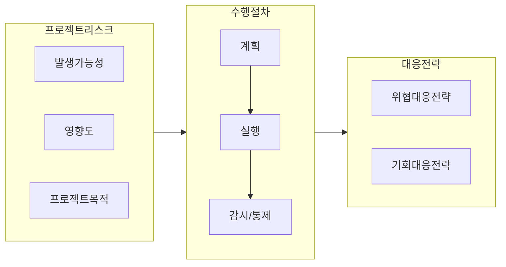

## 위험관리

- 프로젝트에서 위험을 최소화하고 성공적으로 완료하기 위해 식별된 위험요인을 분석, 분류하고 대응하는 관리활동
- ISO 31000, PMBOK6을 참조하여 리스크 베이스라인 설정

## 위험관리 개념도, 리스크 대응 절차

### 위험관리 개념도

### 리스크 대응 절차

| 구분 | 절차 | 설명 |
|---|---|---|
| 계획 | 위험관리계획수립 | 위험관리 전반 활동 정의, 위험관리계획서 작성 |
| | 위험식별 | 프로젝트 위험 식별과 특정 문제 파악, 위험관리대장 작성 |
| | 정성적 위험분석 | 발생확률과 영향도 평가, 우선순위 결정, P/T 우선순위 선정 |
| | 정량적 위험분석 | 프로젝트 목표에 미치는 영향 수치적 분석, 위험보고서 작성 |
| | 위험대응계획수립 | 대응 전략 수립 및 처리방안 마련, 대응계획서 작성 |
| 실행 | 위험 대응 실행 | 수립된 위험 대응 및 계획 실행, 변경 요청 수행 |
| 감시/통제 | 위험 감시 및 통제 | 실행 결과 모니터링, 영향 분석, 작업 성과 보고서 작성 |

## 위협/기회 대응전략

### 부정적 리스크 대응전략

> 회전감수이

| 대응 수준 | 대응 방안 | 설명 |
|---|---|---|
| 적극적 | 이관 Escalation | 위험이 발생할 가능성이 있는 활동을 변경하거나 제거하여 위험을 회피 |
| | 회피 Avoidance | 위험 발생 가능성을 원천적으로 제거 |
| | 전가 Transference  | 대응 조치를 제3자(보험, 외부 업체 등)에게 전가하여 리스크 감소 |
| 소극적 | 감소 Mitigation | 위험 발생 가능성과 영향을 감소하도록 대응 |
| | 수용 Acceptance | 대응 전략 없이 위험을 감수하고 발생 시 대응 수행 |

### 긍정적 리스크 대응전략

> 활공향수

| 대응 수준 | 대응 방안 | 설명 |
|---|---|---|
| 적극적 | 이관 Transfer | 프로젝트 실행을 제3자에게 전가하거나 위탁하여 기회를 극대화 |
| | 활용 Exploit | 기회 극대화를 위해 적극적 활용 전략을 수립 및 실행 |
| | 공유 Share | 기대한 비율을 제3자와 공유하여 공동의 이익 창출 |
| 소극적 | 향상 Enhance | 긍정적 영향을 식별한 후 최대화하여 기회 규모 변경 |
| | 수용 Acceptance | 기회를 판단하지만 소극적 대응 수행 |
