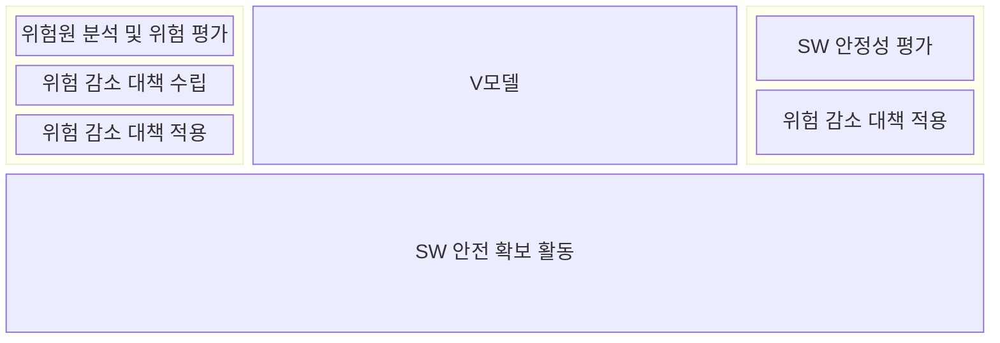
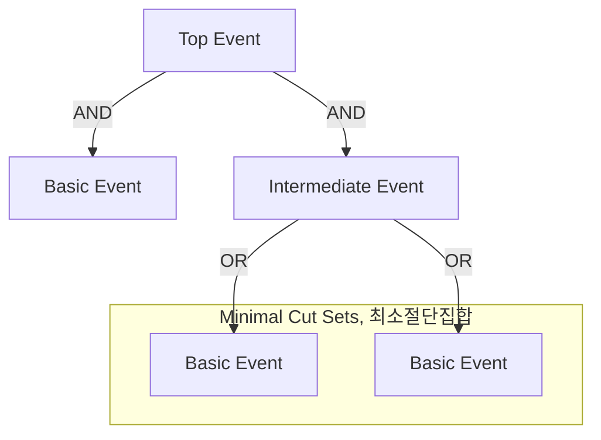
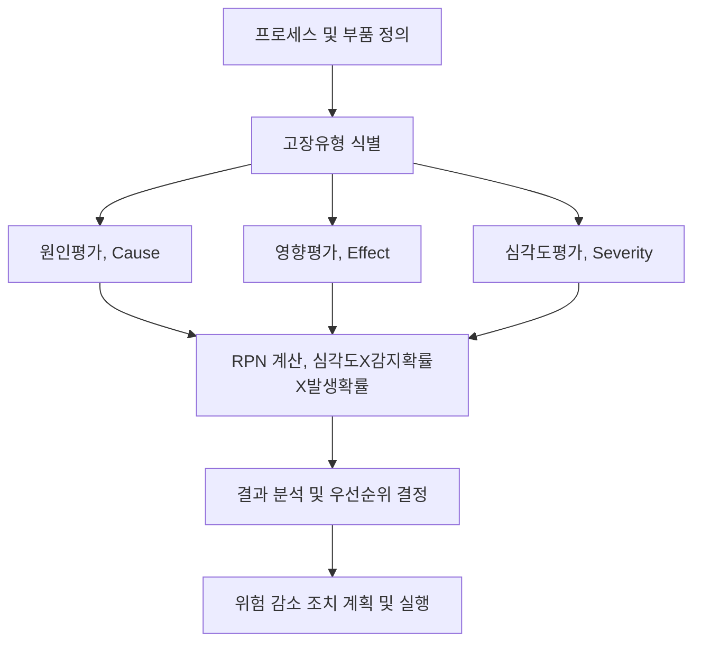

> 131

## 소프트웨어 안정성 분석 개요

- 각 개발 수명주기에서 안전 보증, 확인 활동 수행
- SW시스템의 오류, 장애, 실패를 예방하고, 위험을 회피, 전가, 감수, 수용하기 위해 시스템 위험요소를 식별하고 평가하는 과정.
- IoT와 안전필수시스템(자율주행, UAM 등)의 기능적 사고로 인한 인명피해방지를 위해 필요

## 소프트웨어 안정성 분석 주요 기법

### FTA, Fault Tree Analysis

- 시스템 주요 실패 이벤트를 트리구조롤 분석하여 원인 규명
- Top-Down 방식
- 분석범위의 정의 및 분석수준의 결정 -> 대상제품의 특성 파악 -> 정상사상 정의 -> 결함수의 구성 -> 결함트리의 정성적 분석 -> 결함트리의 정량적 분석 -> 분석결과의 평가 및 보고

### FMEA, Failure Mode and Effects Analysis

- 분석 과제 정의 및 분석 준비 -> 분석 실시 -> 분석 결과의 정리 및 심층 분석

### HAZOP, Hazard and Operability study

- 목적 및 분석범위 설정 -> 분석팀 구성 -> 예비조사 -> 브레인스토밍 -> 분석결과 기록

## 소프트웨어 안정성 분석시 고려사항

- ISO 26262 등 해당 산업의 규제 및 표준을 준수하여 분석 수행
