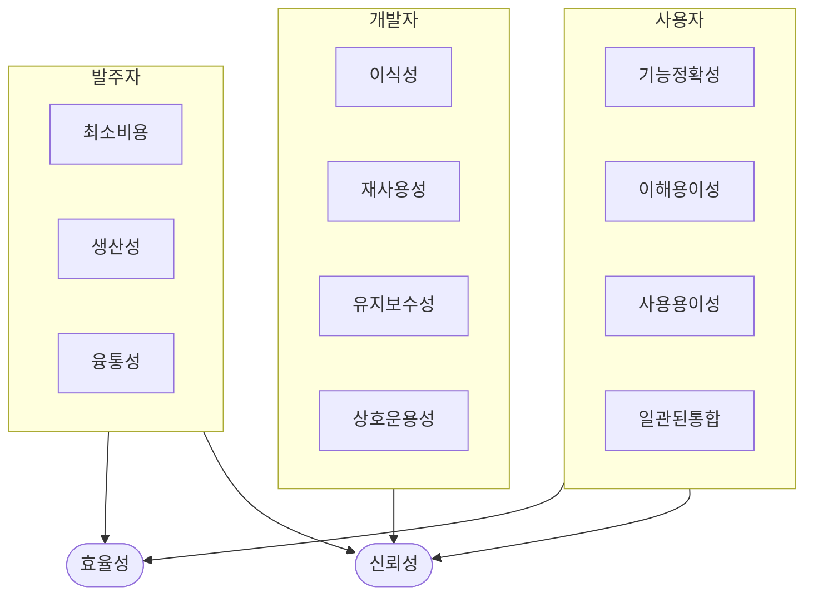

## 좋은 소프트웨어의 개념

- SW 발주자, 개발자, 사용자 모두에게 이점을 제공하는 소프트웨어로서 기능성, 신뢰성, 사용성, 효율성, 유지보수성, 이식성, 호환성, 보안성 등 소프트웨어 품질특성을 만족하는 소프트웨어
- ISO 25010 국제 표준 기반 특성 정의 및 품질 확보

## 좋은 소프트웨어 개념도

### 좋은 소프트웨어 조건

| 구분 | 특징 | 설명 |
| --- | --- | --- |
| 기본 요구 | 정확성 (Correctness) | 기능이 요구사항과 일치하며 표준에 적합 |
| | 신뢰성 (Reliability) | 오류 없이 일정 기간 안정적으로 작동 |
| 안정성과 성능 | 강인성 (Robustness) | 예상하지 못한 상황에서도 정상 작동 |
| | 성능 (Performance) | 처리 속도와 자원 활용 효율성 |
| 사용자 경험 | 사용 용이성 (Usability) | 사용자 친화적이고 쉽게 사용할 수 있음 |
| 유지 및 확장성 | 유지보수성 (Maintainability) | 결함 수정 및 기능 확장이 용이 |
| | 재사용성 (Reusability) | 기존 소프트웨어를 재사용 가능 |
