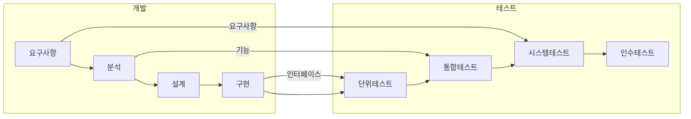

## 소프트웨어 테스트 개념 및 원칙

### 소프트웨어 테스트 개념

- 소프트웨어가 요구사항을 충족하고 프로덕트의 신뢰성 향상을 위해 결함 없이 안정적으로 동작하는지 검증하는 과정

### 소프트웨어 테스트 7원칙

| 원칙 | 내용 | 비고 |
| --- | --- | --- |
| 결함 발견 | 결함이 있음을 입증하는 활동, SW는 시간이 지나면 언제든 결함 발생 가능성이 있음 | 테스트의 역할 |
| 완벽한 테스트 불가 | 모든 가능한 조합을 테스트하는 것은 현실적 불가능 | 자원의 한계 |
| 초기에 테스트 시작 | 개발 초기에 결함발견 중요, 파레토 법칙 적용 | 품질비용 감소 |
| 결함 집중 | 동일 테스트케이스 반복 시 신규 결함발견 능력 감소 | TC 정기적 개선 |
| 정황 의존성 | 테스트 방법/접근은 소프트웨어 성격에 따라 차별화 적용 | 외부요소 반영 |
| 오류 부재 궤변 | 결함이 없더라도 요구사항 미충족시 실패 | 요구사항 충족 |

## 명세기반 테스트, 구조기반 테스트, 경험기반 테스트

### 명세기반 테스트

| 기법 | 개념도 | 설명 |
| --- | --- | --- |
| 동등 클래스 분할 | | 데이터 구간별 대표 값을 도출하여 테스트하는 방법 다양한 입력 조건을 갖춘 테스트 케이스의 유형들을 분할 |
| 경계값분석 | | 경계값 주변에서 결함이 많은 원리 이용 유효, 비유효 경계값 고려한 TC 설계 경험적, 결함발견율 높음 |
| 의사결정 테이블 | | 조건에 따른 Y/N 조합으로 TC 작성 조건과 상황 기반 |
| 상태전이 | | 상태전이 다이어그램 구성하여 상태 변화요소들을 조합하여 TC 작성 임베디드 시스템에서 주로 활용 |
| 유스케이스 | | 유스케이스 명세서를 활용한 비지니스 시나리오 테스트 컴포넌트 레벨, 시스템 레벨 유스케이스 테스팅 |
| 분류 트리 | | SW 일부/전체를 트리구조로 분석/표현하여 TC 설계 테스트 가시화로 중복/누락 회피 |
| 페어와이즈 조합 | |대부분 결함이 2개 이상 요소의 조합으로 이뤄져있기에 상호작용조합으로 TC 작성 경험적 의미 조합 |
| 오류예측기법 | | 각 테스트 기법이 놓치기 쉬운 오류들을 경험적으로 찾아 검증 Ad-hoc 테스팅 |

### 구조기반 테스트

| 기법 | 설명 | 비고 |
| --- | --- | --- |
| 제어구조 | 프로그램 논리 복잡도 기반 TC 설계 기법 | 논리 복잡도, 흐름 제어 |
| 루프 테스트 | 루프 구조에 한하여 실시하는 기법, 초기화, 인덱싱, 루프 경계선 결함 발견 목적 | 루프 구조, 초기화, 경계값 |
| 구문 커버리지 | 모든 문장이 최소 한 번은 실행될 수 있는 입력 데이터를 테스트 데이터로 선정 프로그램 내 모든 구문 보장 | 모든 구문, 실행 여부 |
| 결정 커버리지 | 전체 결정문이 적어도 한 번은 참/거짓을 반환하도록 수행 | 결정문, 조건 참/거짓 |
| 조건 커버리지 | 결정 명령문 내 각 조건이 적어도 한 번은 참/거짓을 반환하도록 수행 | 개별 조건, 참/거짓 |
| 조건/결정 커버리지 | 전체 조건식뿐 아니라 개별 조건식도 참/거짓을 한 번 수행 | 전체 조건식, 개별 조건식 |
| 변경조건/결정 커버리지 | 각 개별 조건식이 다른 개별 조건식에 영향받지 않고 전체 조건식에 독립적으로 영향을 주게 수행 | 독립 조건, 조건 영향 |
| 다중조건/결정 커버리지 | 결정 포인트 내 있는 모든 개별 조건의 모든 조합을 고려 | 모든 조건 조합 |

### 경험기반 테스트

| 기법 | 개념도 | 특징 |
| --- | --- | --- |
| 오류 추정 | | 가능한 결함을 나열하고 결함이나 오류를 추정에 의해 검출/수정 |
| 탐색적 기법 | | 학습과 테스트 디자인, 테스트 수행을 동시에하는 휴리스틱 테스트 기법 |
| 체크리스트 | | 테스트/평가해야할 내용과 경험을 분류하여 나열해 놓은 체크리스트 기반 테스트 수행 |
| 분류 트리 | | 흐름을 트리구조로 시각화하여 테스트 케이스 설계 |
