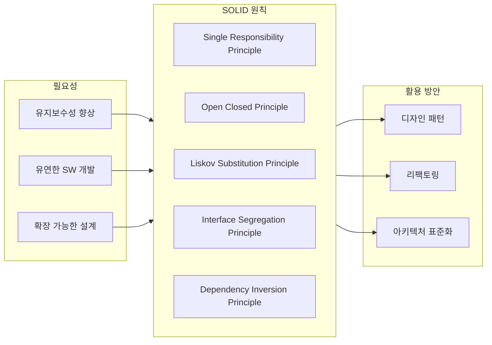
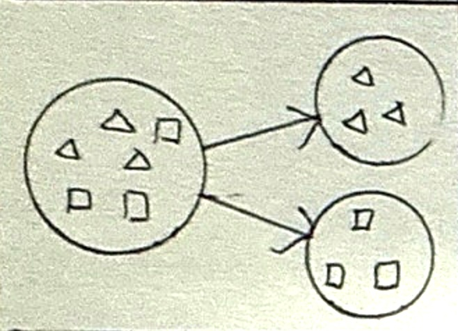
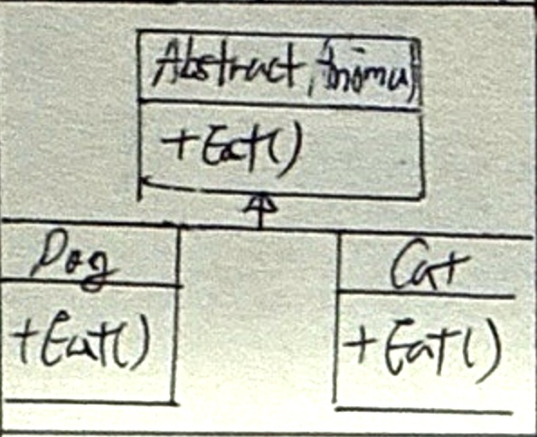
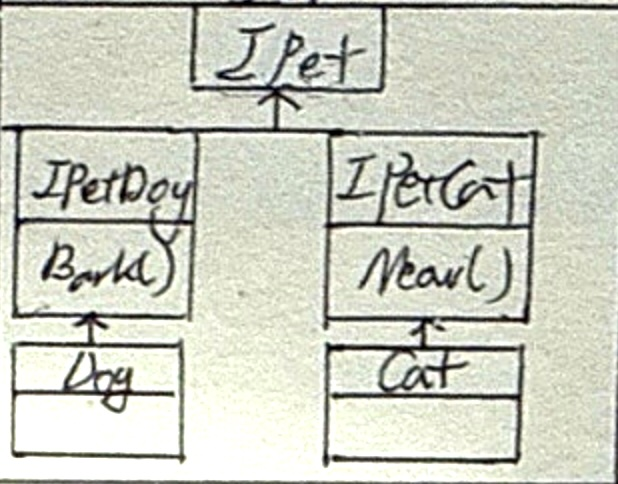
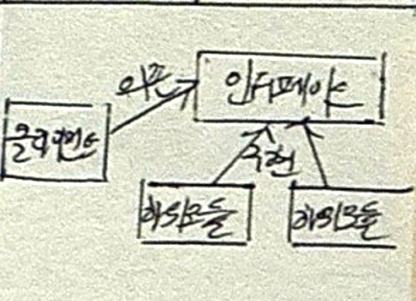

## SOLID 원칙 개념

- 객체지향 설계시 SOLID 5가지 원칙을 준수하여 유지보수성과 확장성을 가진 유연한 소프트웨어 구현 가능

## 단일책임원칙과 개방폐쇄원칙

### 단일책임원칙

| 구분 | 설명 |
| --- | --- |
| 개념도 |  |
| 개념 | 객체는 단 하나의 책임만 가져야한다는 원칙 |
| 특징 | 변경에 대한 의존성 극복, 응집도 향상 |
| 예시 | 파일 읽기, 쓰기 클래스 분리 |

### 개방폐쇄원칙

| 구분 | 설명 |
| --- | --- |
| 개념도 |  |
| 개념 | 클래스는 확장에는 열리고 수정에는 닫혀있어야한다는 원칙 |
| 특징 | 추상화로인한 다형성, 확장성, 객체지향 장점 극대화 |
| 예시 | 새로운 기능 추가시 추상클래스 활용 |

## 리스코프 치환원칙과 인터페이스 분리원칙

### 리스코프 치환원칙

| 구분 | 설명 |
| --- | --- |
| 개념도 |  |
| 개념 | 상위 클래스는 하위 클래스로 대체할 수 있어야한다는 원칙 |
| 특징 | 상속을 통한 재사용성 확보, 부모-자식 클래스 간 IS-A 관계 보장 |
| 예시 | HashSet은 Set의 add 메소드 사용 가능 |

### 인터페이스 분리원칙

| 구분 | 설명 |
| --- | --- |
| 개념도 |  |
| 개념 | 클라이언트는 자신이 사용하는 인터페이스만 의존해야하는 원칙 |
| 특징 | 클라이언트에 목적과 용도에 적합한 인터페이스 제공, 확장성 증가 |
| 예시 | Pet 인터페이스 분리로 짖는 기능 구현 |

## 의존성역전원칙

| 구분 | 설명 |
| --- | --- |
| 개념도 |  |
| 개념 | 고수준 클라이언트는 저수준 모듈의 구현에 의존하지 않고, 추상화된 인터페이스에 의존해야한다는 원칙 |
| 특징 | 변화하기 어려운 인터페이스에 의존, 결합도 완화 |
| 예시 | 특정 DB클래스가 아닌 Database 인터페이스 사용 연동 |

## 객체지향 설계시 고려사항

- SonarLint 등 정적분석도구 활용 SOLID 원칙 준수 감사
- 예방비용을 높여 SW품질 향상 필요
